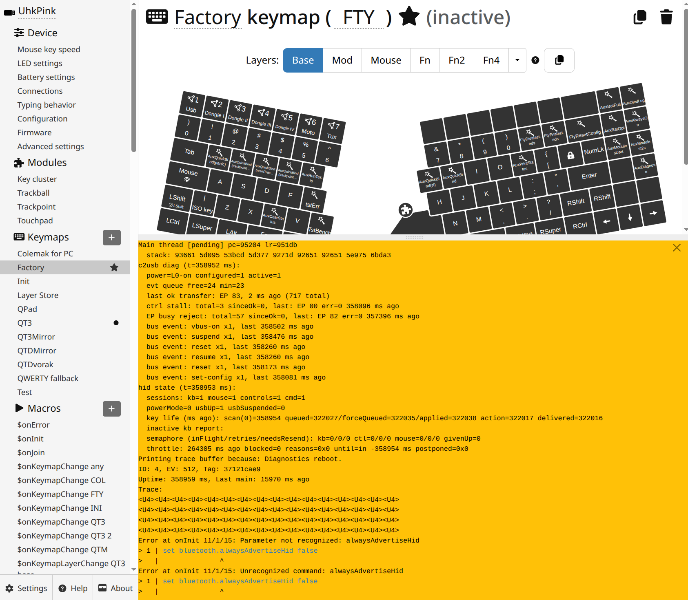

When Uhk or its usb stack completely stops working, please follow this procedure to collect a state dump. Once you have it, please report it to us, preferably via a github issue.

# Uhk80

## Method 1 - for right half and stuck usb stack

Create a macro named `$onInit`, with following content:

```
set recoveryKey rightCtrl
```

Feel free to change the binding to any right half key. You can find the list of available keys at [reference-manual.md](https://github.com/UltimateHackingKeyboard/firmware/blob/master/doc-dev/reference-manual.md) under the KEYID_ABBREV grammar term. Note that these mark hardware position in the key matrix according to the default (enUs) keycap prints, not user-applied mappings.

Once the keyboard becomes unresponsive, press the configured key. This reboots the keyboard while logging the state dump into the error buffer. 

Continue by opening the Agent. A yellow pane with diagnostics should pop up. Copy & paste & send it to us.



## Method 2 - either half, requires working usb stack

Access UHK's logs via Agent's [advanced settings](logs.md).

Enter `uhk recover` in the command line. 

Then enter `uhk printStatus`. 

Send us the log.

# Uhk60

Above procedure is not applicable to Uhk60. Please let us know if you need to debug uhk60 this way.
