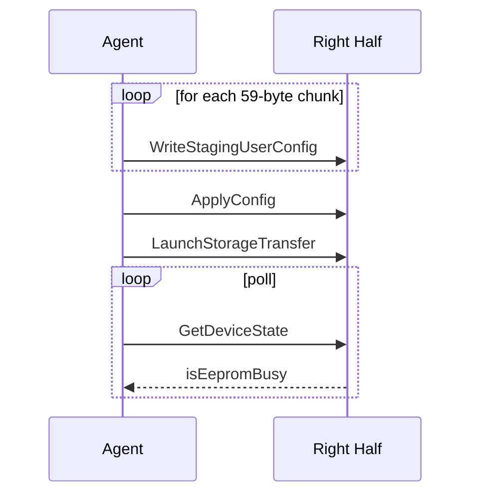
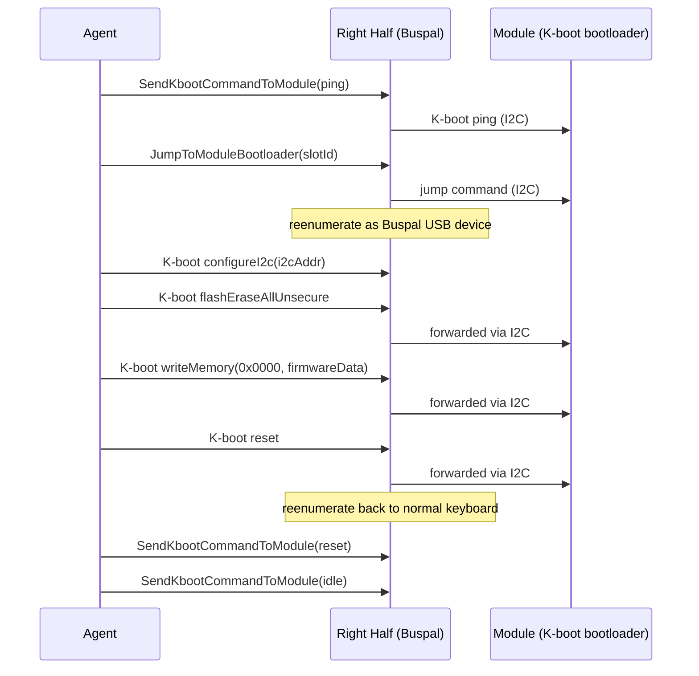
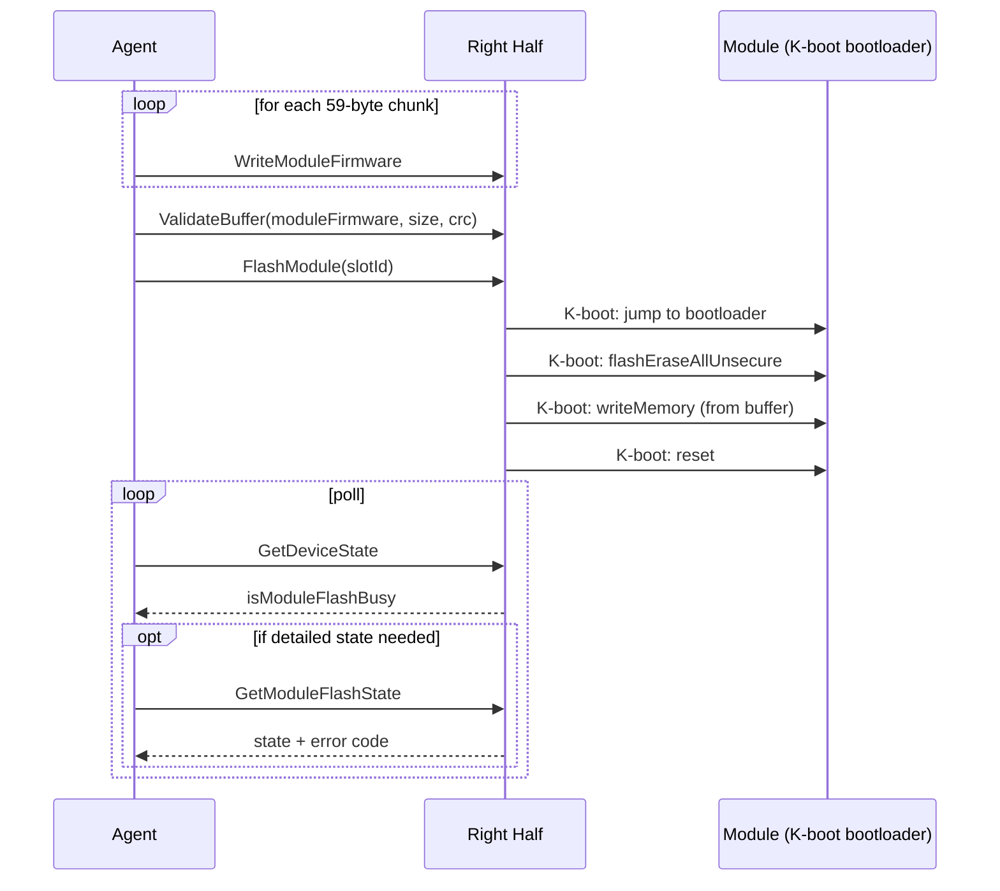

# Firmware Upload Proposal

## 1. USB Protocol

63-byte HID reports. All multi-byte integers are little-endian.

Every response starts with a status byte (0 = success).

## 2. Current: UserConfig Flashing

### WriteStagingUserConfig (0x06)

| Byte | Field         |
|------|---------------|
| 0    | 0x06          |
| 1    | payload length (max 59) |
| 2-3  | offset into staging buffer |
| 4+   | data          |

Response: status byte only.

### ApplyConfig (0x07)

| Byte | Field |
|------|-------|
| 0    | 0x07  |

Validates the staging buffer. On success, swaps staging ↔ validated buffers.

Response:

| Byte | Field |
|------|-------|
| 0    | status |
| 1-2  | parser offset (where parsing stopped) |
| 3    | parser stage (0=validate, 1=apply) |

### LaunchStorageTransfer (0x08)

| Byte | Field |
|------|-------|
| 0    | 0x08  |
| 1    | operation (0=read, 1=write) |
| 2    | buffer id (0=hardware, 1=stagingUser, 2=validatedUser) |

Response: status byte only.

### GetDeviceState (0x09)

| Byte | Field |
|------|-------|
| 0    | 0x09  |

Response:

| Byte | Field |
|------|-------|
| 0    | status |
| 1    | busy flags: bit 0 = isEepromBusy, bit 1 = isModuleFlashBusy (**new**) |
| 2    | flags (halvesMerged, pairing, zephyrLog) |
| 3-5  | connected module IDs (left half, left mod, right mod) |
| 6    | active layer (bits 0-6) + toggled flag (bit 7) |
| 7    | macro status dirty |
| 8    | current keymap index |

## 3. Current: Module Firmware Flashing

Currently, module firmware flashing is Agent-driven. The right half acts as a USB-to-I2C bridge ("Buspal" mode) and the Agent speaks K-boot protocol directly over that bridge:

### SendKbootCommandToModule (0x03)

| Byte | Field |
|------|-------|
| 0    | 0x03  |
| 1    | command (0=idle, 1=ping, 2=reset) |
| 2    | i2c address (omitted for idle) |

Triggers the kboot_driver state machine on the right half, which sends K-boot framed ping/reset packets over I2C.

### JumpToModuleBootloader (0x02)

| Byte | Field |
|------|-------|
| 0    | 0x02  |
| 1    | slot id |

Sets the module phase to `JumpToBootloader`, causing the module driver to send a jump command via I2C.

### Buspal Mode

After jumping the module to bootloader, the Agent reenumerates the right half into Buspal mode (EnumerationMode 1). In Buspal mode, the right half becomes a transparent USB↔I2C bridge. The Agent then uses a K-boot library (`KBoot` class) to speak the K-boot framing protocol directly, sending `flashEraseAllUnsecure`, `writeMemory`, and `reset` commands.

## 4. Proposed: Firmware-Driven Module Flashing

Move K-boot protocol handling from the Agent into the firmware. The Agent sends firmware data using the same chunked transfer pattern as config flashing. The firmware handles K-boot protocol internally.

### WriteModuleFirmware (new, 0x20)

| Byte | Field |
|------|-------|
| 0    | 0x20  |
| 1    | payload length (max 59) |
| 2-3  | offset into firmware buffer |
| 4+   | data |

Same chunked transfer pattern as WriteStagingUserConfig.

### FlashModule (new, 0x21)

| Byte | Field |
|------|-------|
| 0    | 0x21  |
| 1    | slot id |

Triggers the full K-boot flash sequence internally: jump to bootloader → erase → write → reset.

### GetModuleFlashState (new, 0x22)

| Byte | Field |
|------|-------|
| 0    | 0x22  |

Response:

| Byte | Field |
|------|-------|
| 0    | status |
| 1    | flash state (0=idle, 1=erasing, 2=writing, 3=done, 4=error) |
| 2    | error code (if state=error) |

### ValidateBuffer (new, 0x23)

| Byte | Field |
|------|-------|
| 0    | 0x23  |
| 1    | buffer id (0=hardware, 1=stagingUser, 2=validatedUser, 3=moduleFirmware) |
| 2-3  | expected size |
| 4-5  | expected CRC16 |

Firmware computes CRC over the first `size` bytes of the given buffer and compares it to the expected value.

Response:

| Byte | Field |
|------|-------|
| 0    | status (0=match, non-zero=mismatch) |

### Advantages

- No Buspal reenumeration needed (disruptive, platform-dependent)
- Agent doesn't need K-boot library or I2C knowledge
- Same pattern as config flashing — simple for Agent authors
- Firmware can manage timing and retries internally

### Open question: buffering

Module firmware can be up to ~128KB. The 16-bit offset field supports up to 64KB. Options:

- **A. Buffer in RAM**: Requires large allocation. Possible on UHK80 (nRF has more RAM), tight on UHK60.
- **B. Stream to module**: Forward each chunk to the module bootloader immediately via K-boot writeMemory. No buffer needed, but the module must already be in bootloader mode during the upload. Requires the Agent to wait for each chunk's I2C completion.
- **C. Use 24-bit offset**: Extend the offset field to 3 bytes (payload drops to 58 bytes) to support >64KB. Only needed if buffering.
