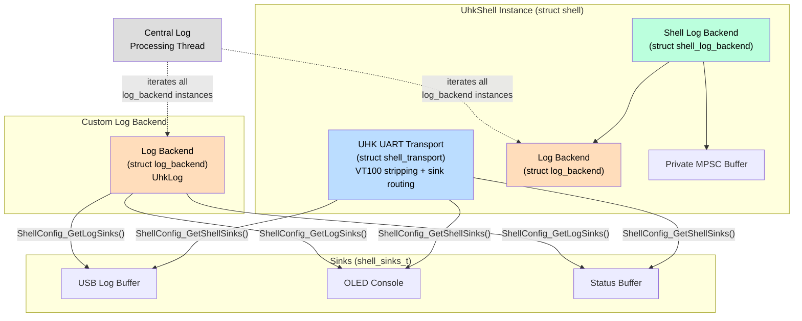
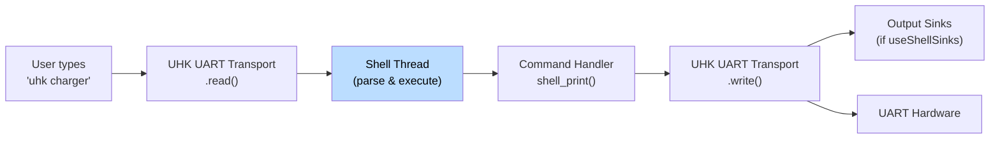
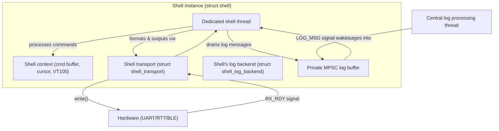
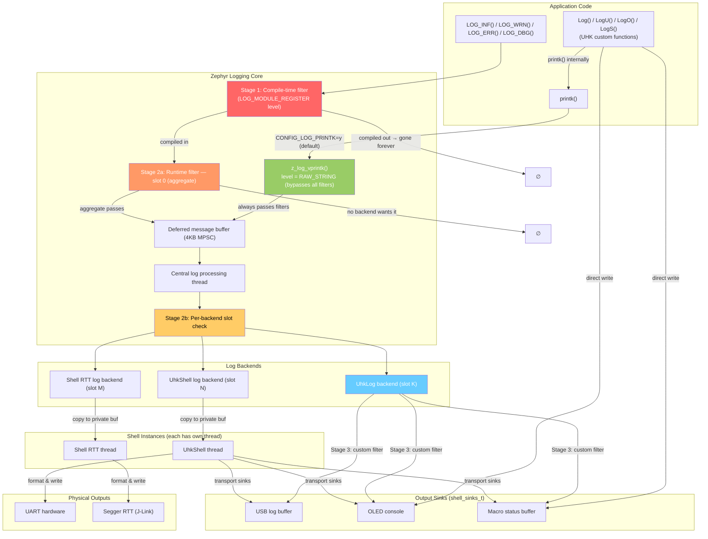
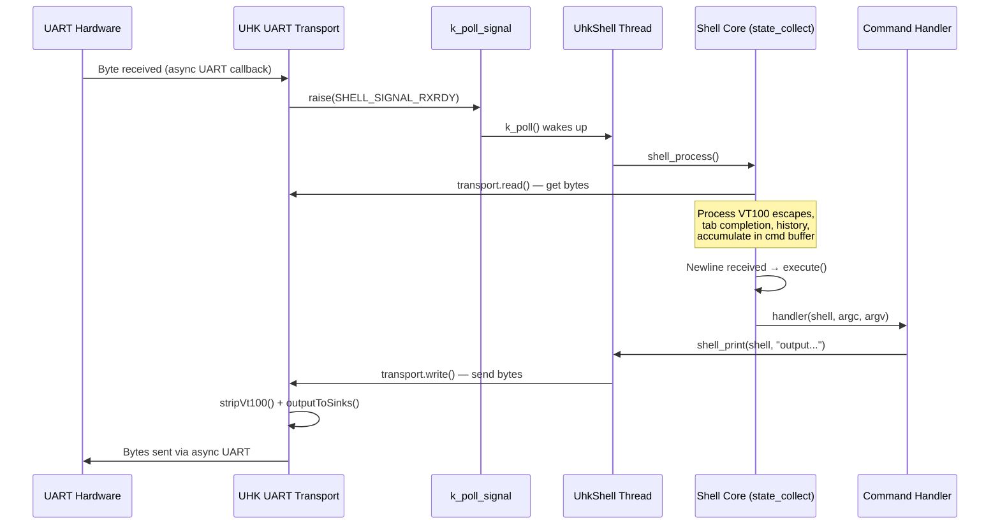
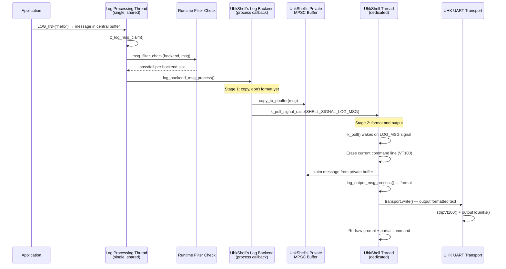
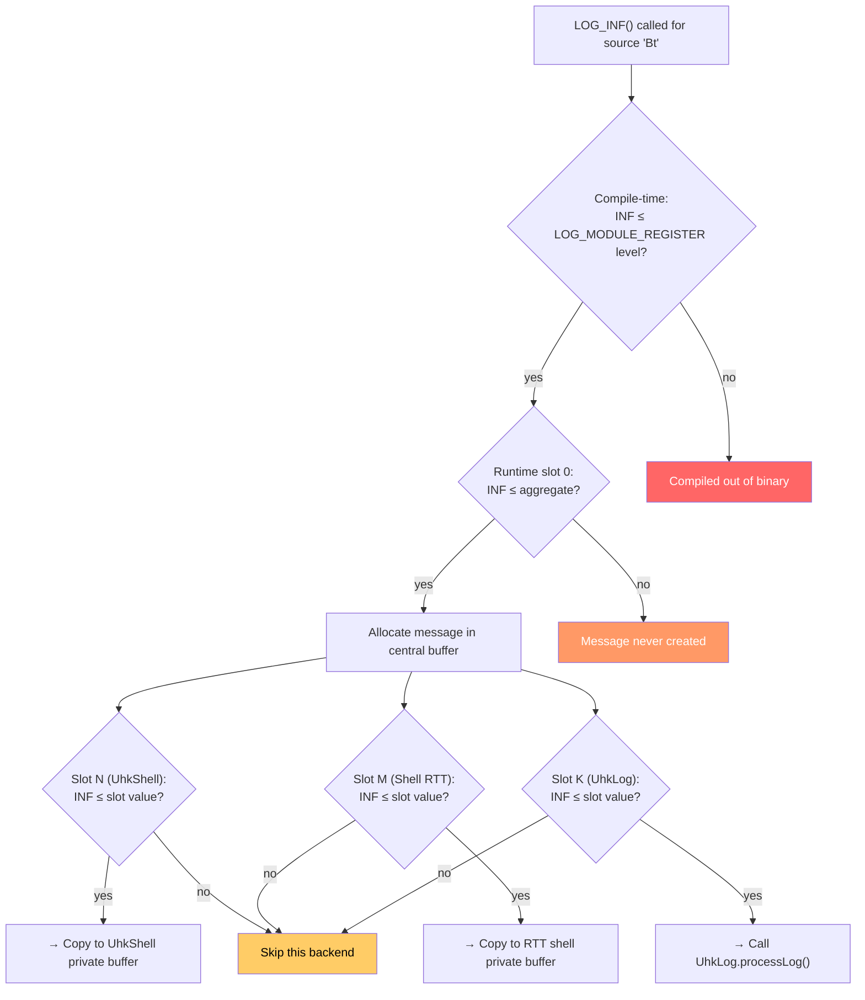
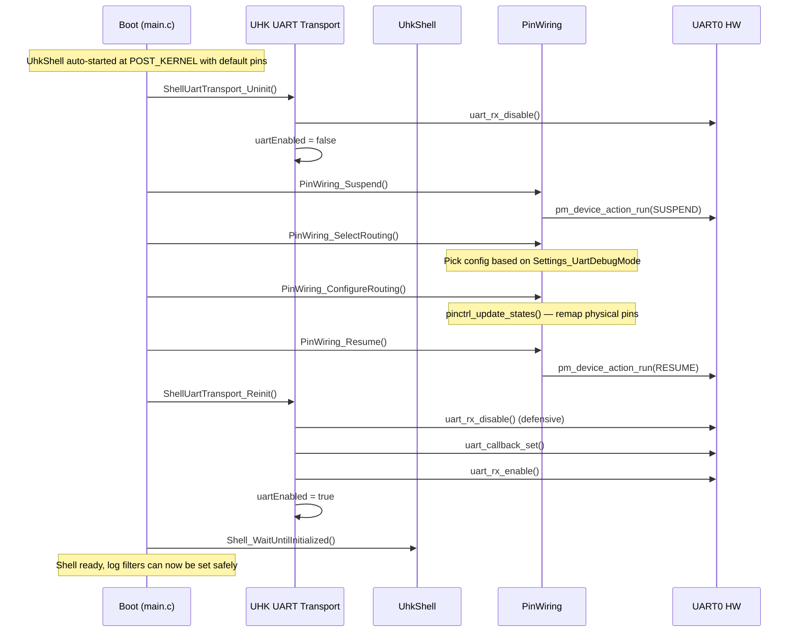

# Zephyr Shell, Shell Backends, and Logging Backends

This document explains how Zephyr's shell subsystem, shell backends, and logging subsystem interact — with a focus on log filtering, because understanding the multiple filtering stages is essential for debugging "why does my message appear on one backend but not another?"

## Helicopter View

### Ownership Structure



The **UhkShell** instance owns a custom **UHK UART transport** (byte I/O with VT100 stripping and output sink routing) and a **shell log backend** (which wraps a `log_backend` + private buffer). The **UhkLog** backend is standalone — the central log thread discovers both via the same linker section. Both the transport and UhkLog route output to **sinks** (USB buffer, OLED, status buffer) via a shared configuration.

### Path of Shell Command Output



Shell command output goes **directly** from the command handler through the UHK UART transport. The transport both sends to the physical UART and routes to output sinks (USB buffer, OLED, status buffer) after stripping VT100 escape sequences. It **never** passes through the central logging core.

### Path of a LOG_INF() Message to a Shell

```mermaid
graph LR
    APP["LOG_INF('hello')"] --> FILTER["Compile-time\n& runtime\nfilters"]
    FILTER --> CENTRAL_BUF["Central\nMPSC Buffer"]
    CENTRAL_BUF --> LOG_THREAD["Log Processing\nThread"]
    LOG_THREAD -->|"per-backend\nslot check"| SHELL_LB["Shell Log Backend\n.process()"]
    SHELL_LB -->|"memcpy"| PRIV_BUF["Shell's Private\nMPSC Buffer"]
    PRIV_BUF -->|"signal"| SHELL_THREAD["Shell Thread\n(format & write)"]
    SHELL_THREAD --> TRANSPORT["UHK UART Transport\n.write()"]
    TRANSPORT --> HW["UART / Sinks"]

    style LOG_THREAD fill:#ddd,color:#000
    style SHELL_THREAD fill:#bdf,color:#000
    style SHELL_LB fill:#bfd,color:#000
```



A `LOG_INF()` goes through two threads: the **central log thread** (filter + copy to private buffer) and the **shell thread** (format + VT100 line management + write). The shell thread erases the current command line before printing the log message and redraws it after.

Note: `printk()` takes this same path (when `CONFIG_LOG_PRINTK=y`, the default), but with a special level that bypasses all filters.

## Zephyr Concepts

### struct shell — A Shell Instance

A `struct shell` is a **complete, self-contained interactive terminal**. It owns:

- A **transport** (`struct shell_transport`) — the byte-level I/O channel (UART, RTT, BLE NUS, ...)
- A **dedicated thread** — each shell instance gets its own `k_thread` with its own stack
- A **log backend** (`struct shell_log_backend`) — makes this shell instance receive log messages
- Runtime state: command buffer, cursor, VT100 terminal state, prompt, command history

Shell instances are created at compile time by the `SHELL_DEFINE` macro. Each transport backend (UART, RTT, BLE NUS) creates one instance.

### Shell Transport (aka "Shell Backend")

A `struct shell_transport` is the **byte-level I/O driver** behind a shell instance. It implements the `shell_transport_api` interface:

| Method | Purpose |
|--------|---------|
| `init()` | Initialize, register event callback |
| `enable()` | Start I/O |
| `write()` | Send bytes to the hardware |
| `read()` | Receive bytes from the hardware |
| `uninit()` | Tear down |

The transport signals the shell via a callback with `SHELL_TRANSPORT_EVT_RX_RDY` (data available to read) and `SHELL_TRANSPORT_EVT_TX_RDY` (transmit complete). These raise `k_poll_signal`s that wake the shell thread.

Zephyr provides concrete implementations: UART (`shell_uart.c`), RTT (`shell_rtt.c`), BLE NUS (`shell_bt_nus.c`), Telnet, etc. The UHK firmware uses a **custom UART transport** (`shell_transport_uhk.c`) instead of Zephyr's standard one.

### Log Backend

A `struct log_backend` is a **consumer of log messages**. It implements the `log_backend_api` interface:

| Method | Purpose |
|--------|---------|
| `process()` | Receive and handle a log message |
| `panic()` | Enter panic mode (switch to synchronous output) |
| `init()` | Initialize |
| `is_ready()` | Check if backend can accept messages |
| `dropped()` | Notification that messages were dropped |

Log backends are registered at compile time via `LOG_BACKEND_DEFINE` into a linker section. The logging core iterates this section to dispatch messages.

**Key distinction:** A "shell backend" (= shell transport, byte-level I/O) and a "log backend" (= log message consumer) are **different concepts**. But each shell instance **also creates a log backend** (via `Z_SHELL_LOG_BACKEND_DEFINE` inside `SHELL_DEFINE`), so every shell is simultaneously both.

### How They Relate



Each shell instance is created by `SHELL_DEFINE`, which expands to:
1. `K_KERNEL_STACK_DEFINE` — allocate a thread stack
2. `Z_SHELL_LOG_BACKEND_DEFINE` — create a `LOG_BACKEND_DEFINE` + private MPSC buffer
3. Wire everything together into `struct shell`

## Architecture Overview



**Note on `printk()`:** When `CONFIG_LOG_PRINTK=y` (the Zephyr default; this firmware does not override it), `printk()` creates a real log message with level `LOG_LEVEL_INTERNAL_RAW_STRING`. This special level **bypasses all runtime filters** — the message is delivered to every active backend unconditionally. This is why the `UhkLog` backend receives `printk()` messages.

**Note on UHK `Log()`/`LogU()`/etc.:** These call `printk()` for UART output, so they also flow through the logging subsystem. But they also write directly to OLED and status buffer (bypassing logging entirely for those targets).

## Shell Command Flow (Input → Execution → Output)



## Shell Log Message Flow (Two-Stage Delivery)

Log messages reach shells through a **two-stage process**. This is deliberate — it decouples the central log thread from per-shell VT100 terminal management.



This two-stage design means:
- The central log thread only does a fast memcpy, not formatting or VT100 manipulation
- Each shell thread handles its own terminal state (erasing/redrawing the command line around log output)
- Different shells can format independently without blocking each other

## Per-Shell Log Filter Settings

### The Filter Word

When `CONFIG_LOG_RUNTIME_FILTERING=y`, each log source gets a 32-bit filter word in RAM, divided into 3-bit slots:

```
Bits:  [29:27] [26:24] ... [8:6] [5:3] [2:0]
Slot:    9       8     ...   2     1     0
         |       |           |     |     |
       Backend Backend    Backend Backend AGGREGATE
         9       8          2      1     (max of all)
```

- **Slot 0 (aggregate):** Maximum level across all backend slots. Checked first — if the message level exceeds slot 0, the message is never allocated (saves CPU + memory).
- **Slots 1–N:** One per active backend. Each backend gets a unique slot ID assigned at `log_backend_enable()` time.

### How `log enable` Works on a Specific Shell

When you type `log enable dbg mymodule` on a shell:

1. The command handler `cmd_log_self_enable()` in `log_cmds.c` receives `const struct shell *sh` — the shell instance you're typing on.
2. It accesses `sh->log_backend->backend` — the `struct log_backend` associated with **this** shell.
3. It calls `log_filter_set(sh->log_backend->backend, 0, source_id, LOG_LEVEL_DBG)`.
4. This writes `LOG_LEVEL_DBG` into this backend's 3-bit slot in the source's filter word.
5. Slot 0 (aggregate) is recalculated as `max(all backend slots)`.

**Only this shell's slot changes.** The RTT shell and UhkLog backend are unaffected.

To change a different backend's level, use `log backend <name> enable dbg mymodule`.

### What `log_filter_set(NULL, ...)` Does

When backend is `NULL` (as used by UHK's `InitLogLevels()`), **all backend slots AND the aggregate** are set to the specified level. This is a bulk operation.

### Full Filter Check Flow



## The Three Filtering Stages (Detail)

### Stage 1: Compile-Time Filtering

Completely removes `LOG_*()` calls from the binary. Zero runtime cost. **Irreversible — no runtime API can bring these messages back.**

Controlled by (highest precedence first):

| Setting | Scope | Where |
|---------|-------|-------|
| `CONFIG_LOG_MAX_LEVEL` | Global ceiling | prj.conf (default: `LOG_LEVEL_INF`) |
| `CONFIG_<MODULE>_LOG_LEVEL_*` | Per-Kconfig-module | prj.conf overlays |
| `LOG_MODULE_REGISTER(name, level)` | Per-source-file | C source code |
| `CONFIG_LOG_DEFAULT_LEVEL` | Default for unspecified modules | prj.conf (default: `LOG_LEVEL_INF`) |

**UHK firmware examples:**

```c
// charger.c — DBG and INF are compiled out, only WRN and ERR remain
LOG_MODULE_REGISTER(Battery, LOG_LEVEL_WRN);

// bt_conn.c — DBG is compiled out
LOG_MODULE_REGISTER(Bt, LOG_LEVEL_INF);
```

```ini
# c2usb.conf — compiles DBG level into these modules
CONFIG_UDC_DRIVER_LOG_LEVEL_DBG=y
CONFIG_C2USB_HOGP_LOG_LEVEL_DBG=y
```

### Stage 2: Runtime Filtering (Per-Backend, Per-Source)

Requires `CONFIG_LOG_RUNTIME_FILTERING=y` (enabled in this firmware).

**Flow:**

1. `LOG_INF("...")` called. Compile-time check passes.
2. Read slot 0 → if `INF > aggregate` → drop immediately, never allocate.
3. Slot 0 passes → message created, enqueued in central MPSC buffer.
4. Processing thread dequeues, iterates over backends.
5. For each backend: check that backend's slot → deliver or skip.

**This is why a message can appear on one backend but not another.**

**API:**

```c
// Set filter for one backend + one source:
log_filter_set(backend, domain_id, source_id, level);

// NULL backend = set ALL backend slots + aggregate (slot 0):
log_filter_set(NULL, 0, source_id, level);
```

**UHK usage** (`right/src/logger.c`):

```c
void InitLogLevels() {
    Shell_WaitUntilInitialized();  // critical — see Pitfall #1

    setLevel("hogp", LOG_LEVEL_INF);   // log_filter_set(NULL, ...)
    setLevel("udc", LOG_LEVEL_WRN);
    setLevel("udc_nrf", LOG_LEVEL_WRN);
    setLevel("c2usb", LOG_LEVEL_WRN);
}
```

### Stage 3: Backend-Internal Filtering

Custom logic inside a backend's `process` callback. Happens *after* the logging core already delivered the message.

**UHK example** (`device/src/proxy_log_backend.c`):

```c
static void processLog(..., union log_msg_generic *msg) {
    shell_sinks_t sinks = ShellConfig_GetLogSinks();

    if (WormCfg->devMode) {
        // route c2usb warnings to status buffer in dev mode
        uint8_t level = log_msg_get_level(&msg->log);
        const char *sourceName = getLogSourceName(&msg->log);
        if (level >= LOG_LEVEL_WRN && strcmp(sourceName, "c2usb") == 0) {
            sinks.toStatusBuffer = true;
        }
    }
    // only format if at least one output is active
    if (sinks.toStatusBuffer || sinks.toUsbBuffer || sinks.toOled) {
        log_output_msg_process(&logOutput, &msg->log, ...);
    }
}
```

## UHK Firmware: Shell and Log Backends

### Shell Instances

| Shell | Transport | Registration | Purpose |
|-------|-----------|-------------|---------|
| **UhkShell** | Custom UHK UART transport | `SHELL_DEFINE` + `SYS_INIT` in `shell_uhk.c` | Primary interactive shell over UART, with VT100 stripping and output sink routing |
| **Shell RTT** | Segger RTT | Automatic via `CONFIG_SHELL_BACKEND_RTT=y` | Interactive shell over J-Link |

**Disabled shell backends:**
- `CONFIG_SHELL_BACKEND_SERIAL=n` — replaced by UhkShell with custom transport
- `CONFIG_SHELL_BT_NUS=n` — BLE NUS shell disabled

### Log Backends

| Backend | Registration | Purpose |
|---------|-------------|---------|
| UhkShell's log backend | Automatic via `SHELL_DEFINE` | Log output to UART (+ sinks via transport) |
| Shell RTT's log backend | Automatic via `CONFIG_SHELL_BACKEND_RTT` | Log output to J-Link |
| **UhkLog** | `LOG_BACKEND_DEFINE()` in `proxy_log_backend.c` | Routes to USB buffer, OLED, status buffer via sinks |

Each gets an auto-assigned slot ID and independent per-source filter levels.

### The UHK UART Transport (`shell_transport_uhk.c`)

The UhkShell uses a custom transport instead of Zephyr's standard `shell_uart.c`. Key differences:

- **Async UART** with 4 RX buffers of 16 bytes each
- **VT100 stripping**: All output passes through `stripVt100()` before routing to sinks, removing escape sequences that would garble non-terminal outputs
- **Output sink routing**: Every `write()` call routes the VT100-stripped output to configured sinks (USB buffer, OLED, status buffer) in addition to sending raw bytes to the physical UART
- **Uninit/Reinit API**: `ShellUartTransport_Uninit()` / `ShellUartTransport_Reinit()` for UART pin rerouting during boot

### The Sinks System (`device/src/shell/sinks.c`)

The sinks system provides a unified routing configuration for both shell output and log output. It controls three destinations:

| Sink | Target | When Active |
|------|--------|-------------|
| `toUsbBuffer` | `UsbLogBuffer_Print()` — 2KB circular buffer for USB retrieval | `WormCfg->UsbLogEnabled` |
| `toOled` | `Oled_LogConstant()` / `Oled_Log()` — OLED console widget | `WormCfg->UsbLogEnabled` |
| `toStatusBuffer` | `Macros_SanitizedPut()` — macro status buffer | `ShellConfig_IsInPanicMode` |

**Mutual exclusion**: A `useShellSinks` flag (currently `false`) controls whether sinks are fed from shell output or log output:

```c
shell_sinks_t ShellConfig_GetShellSinks(void) {
    return useShellSinks ? activeConfig() : emptyConfig();
}
shell_sinks_t ShellConfig_GetLogSinks(void) {
    return useShellSinks ? emptyConfig() : activeConfig();
}
```

- **`useShellSinks = false` (current)**: Log messages (via UhkLog backend) go to sinks; shell command output goes only to UART.
- **`useShellSinks = true`**: Shell command output goes to sinks; log messages go only to their shell backends (UART/RTT).

This prevents duplicate output — without mutual exclusion, a `printk()` would appear on sinks both via UhkLog *and* via the UhkShell transport (since `printk()` flows through the shell's log backend and gets written via the transport).

**Panic mode**: `ShellConfig_ActivatePanicMode()` forces `toStatusBuffer = true`, persists the status buffer across reboots via the state wormhole, and prints a panic header with trace.

### OLED Console Widget (`console_widget.c`)

The OLED console is a circular line buffer rendered bottom-to-top (newest at bottom) on the debug screen.

**Newline handling**: Text is processed character-by-character:
- Regular characters append to the current line at the current column
- `\n` advances to a new line only if the current line is non-empty (empty lines are suppressed)
- `\r` is skipped
- Lines that exceed `CONSOLE_BUFFER_LINE_LENGTH` are truncated
- Text without a trailing `\n` stays on the current line — the next call appends to it

**Prompt abbreviation**: The shell prompt `uhk80:right$` is replaced with just `$` to save screen space.

### Shell Command Execution API

Shell commands can be executed programmatically via `Shell_Execute()` (`shell_uhk.c`):

```c
void Shell_Execute(const char *cmd, const char *source);
```

Entry points:
- **USB**: `UsbCommand_ExecShellCommand()` → `Shell_Execute(cmd, "usb")`
- **Macros**: `shell` macro command → `Shell_Execute(cmd, "macro")`

The function retrieves the UhkShell instance, sets a default terminal width of 80 if unset (prevents division-by-zero in Zephyr's shell formatting), and calls `shell_execute_cmd()`.

## UHK Firmware Relevant Configuration

```ini
# nrf_shared.conf
CONFIG_LOG=y
CONFIG_LOG_MODE_DEFERRED=y          # Background thread processes logs
CONFIG_LOG_BUFFER_SIZE=4096         # Central circular buffer for deferred messages
CONFIG_LOG_RUNTIME_FILTERING=y      # Per-backend per-source runtime filters
CONFIG_LOG_CMDS=y                   # Shell "log" commands available
CONFIG_LOG_BACKEND_SHOW_COLOR=y     # ANSI color codes
# CONFIG_LOG_PRINTK defaults to y   # printk() routed through logging subsystem

CONFIG_SHELL=y
CONFIG_SHELL_BACKENDS=y
CONFIG_SHELL_BACKEND_SERIAL=n       # Disabled — replaced by UhkShell custom transport
CONFIG_SHELL_BT_NUS=n               # BLE NUS shell disabled

# prj.conf (debug build)
CONFIG_SHELL_BACKEND_RTT=y          # RTT shell
```

## File Organization

```
device/src/
├── shell.h                      # shell_t struct (keyLog, statLog, etc.)
├── proxy_log_backend.c          # UhkLog log backend — routes to sinks
└── shell/
    ├── shell_uhk.c              # UhkShell instance, Shell_WaitUntilInitialized, Shell_Execute
    ├── shell_uhk.h
    ├── shell_transport_uhk.c    # Custom UART transport with VT100 stripping + sink routing
    ├── shell_transport_uhk.h
    ├── shell_backend_usb.c      # ShellBackend_ListBackends(), ShellBackend_Exec() utilities
    ├── shell_backend_usb.h
    ├── sinks.c                  # Output sink configuration and routing
    └── sinks.h
```

## UHK Shell Reinitialization Sequence (UHK80 Right only)

The UHK80 Right has dynamic UART pin routing — the same UART peripherals serve different functions depending on `Settings_UartDebugMode`. This requires uninitializing and reinitializing the shell during boot:



### Known Issue: UART Shell Input Broken After Cold Reboot

**Symptom:** After a cold reboot (e.g., `NVIC_SystemReset` or watchdog reset) *without* disconnecting power, the UART shell shows output but does not accept input. A full power cycle fixes it.

**Likely cause:** On nRF chips, a soft reset does **not** reset UART peripheral registers. The UART hardware retains state from before the reset:

1. The UART peripheral's RX EVENTS may still be set
2. The async UART driver's internal state machine thinks RX is already active
3. When `uart_rx_enable()` is called during reinit, the driver returns `-EBUSY` because it thinks an RX transfer is already in progress
4. The shell init may silently ignore this error, leaving RX permanently disabled
5. TX works because it doesn't have this stateful issue — each `write()` is independent

**Mitigation:** `ShellUartTransport_Reinit()` now calls `uart_rx_disable()` defensively before re-enabling RX. More aggressive approaches (forcing the UART peripheral into a known state at register level) may be needed.

## Pitfalls

### Pitfall 1: Shell Init Overwrites Runtime Filters

When `shell_start()` enables the shell's log backend via `log_backend_enable()`, it sets the filter for **every source** to the shell's `init_log_level`. If you called `log_filter_set()` before the shell finished starting, your settings get overwritten.

**UHK workaround** (`device/src/shell/shell_uhk.c`):

```c
void Shell_WaitUntilInitialized(void) {
    const struct shell *sh = ShellUhk_GetShellPtr();
    if (sh) {
        // if we set levels before shell is ready, the shell will
        // mercilessly overwrite them
        while (!shell_ready(sh)) {
            k_msleep(10);
        }
    }
}
```

**Note:** This only waits for the UhkShell. If the RTT shell initializes later, it could still overwrite filters for its own slot.

### Pitfall 2: Message Reaches One Backend But Not Another

Per-backend slots are independent. If UhkShell's slot for "Bt" is `LOG_LEVEL_INF` but UhkLog's slot is `LOG_LEVEL_ERR`, then `LOG_INF()` from the Bt module appears on UART but not in the proxy.

Using `log_filter_set(NULL, ...)` sets **all** backend slots uniformly. But subsequent `log enable` shell commands only change one backend's slot.

**Diagnosis:** Use `log status` on the shell to see per-module levels. Compare across different shell backends.

### Pitfall 3: Compile-Time Level is Too Restrictive

If a module is registered with `LOG_MODULE_REGISTER(Battery, LOG_LEVEL_WRN)`, then `LOG_INF()` calls in that module are compiled out. No amount of `log enable inf Battery` will bring them back — you must change the source code and rebuild.

`log status` shows both the runtime filter and the compiled-in ceiling, so you can diagnose this.

### Pitfall 4: Aggregate (Slot 0) Gate

If no backend wants `LOG_LEVEL_DBG` for a source, the aggregate (slot 0) won't include DBG. The message is dropped before allocation and no backend ever sees it. You must raise at least one backend's slot to DBG to get the aggregate to include it.

### Pitfall 5: `printk()` Bypasses All Filters (but NOT the logging subsystem)

With `CONFIG_LOG_PRINTK=y` (the default), `printk()` creates a log message with level `LOG_LEVEL_INTERNAL_RAW_STRING`, which **bypasses all runtime filters**. The message reaches every active backend unconditionally.

This means `printk()` output appears on UhkShell (UART), RTT shell, AND the UhkLog backend. It cannot be silenced via `log disable` or runtime filter settings.

UHK's `Log()`/`LogU()` functions use `printk()` internally for UART output, so they also go through this path.

### Pitfall 6: Shell's Private Buffer Can Fill Up

Each shell has a small private MPSC buffer for log messages. If the shell thread can't drain it fast enough (e.g., the transport is slow, or the thread is preempted), the central log thread's `copy_to_pbuffer()` fails and the message is **dropped** for that shell only. Other backends are unaffected. The shell reports drops via its `dropped()` callback.

### Pitfall 7: Duplicate Output via Sinks

Because `printk()` messages flow through both the UhkLog backend and the UhkShell's log backend (which writes via the transport), enabling sinks on both paths would cause duplicate output. The `useShellSinks` toggle in `sinks.c` prevents this by routing sinks to exactly one path at a time.

## References

### Zephyr Official Documentation

- [Zephyr Logging Subsystem](https://docs.zephyrproject.org/latest/services/logging/index.html) — official reference for logging architecture, filtering, backends, modes
- [Zephyr Shell Subsystem](https://docs.zephyrproject.org/latest/services/shell/index.html) — official reference for shell architecture, transports, commands
- [CONFIG_LOG_PRINTK](https://docs.zephyrproject.org/1.13.0/reference/kconfig/CONFIG_LOG_PRINTK.html) — Kconfig reference for printk-to-logging redirect (default `y` since Zephyr 3.3)

### Zephyr Source Code

- [log_core.c](https://github.com/zephyrproject-rtos/zephyr/blob/main/subsys/logging/log_core.c) — log processing thread, message dispatch, filter checks
- [log_cmds.c](https://github.com/zephyrproject-rtos/zephyr/blob/main/subsys/logging/log_cmds.c) — shell `log enable/disable/status` command implementation

### Zephyr GitHub Discussions & Issues

- [shell_init overrides log filters set by modules (#55703)](https://github.com/zephyrproject-rtos/zephyr/discussions/55703) — the exact pitfall #1 described above
- [Filtering of logs to different backends (#68322)](https://github.com/zephyrproject-rtos/zephyr/discussions/68322) — per-backend filtering discussion
- [Runtime Filtering of Log Levels Not Working Properly (#72818)](https://github.com/zephyrproject-rtos/zephyr/issues/72818) — runtime filter issues
- [Compiling debug logs, but set log level to info by default (#57957)](https://github.com/zephyrproject-rtos/zephyr/discussions/57957) — compile-time vs runtime level separation
- [Incorrect init sequence when log thread has lower priority (#87276)](https://github.com/zephyrproject-rtos/zephyr/issues/87276) — log thread priority and init ordering

### Nordic DevZone — UART Reset Issues

- [UART and UARTE state after reset](https://devzone.nordicsemi.com/f/nordic-q-a/62019/uart-and-uarte-state-after-reset) — UART peripheral state not reset after soft reset
- [UART RX not working after power cycle](https://devzone.nordicsemi.com/f/nordic-q-a/118351/uart-rx-not-working-after-power-cycle) — RX issues after reset
- [Serial RX DATA event not firing after hard reset](https://devzone.nordicsemi.com/f/nordic-q-a/48324/serial-rx-data-event-not-firing-after-hard-reset) — stale RX FIFO bytes after reset
- [UART Overrun Error after Reset](https://devzone.nordicsemi.com/f/nordic-q-a/18481/uart-overrun-error-after-reset) — overrun errors from stale peripheral state
- [nRF52832 Softreset](https://devzone.nordicsemi.com/f/nordic-q-a/60653/nrf52832-softreset) — general soft reset peripheral behavior

### Blog Posts

- [Debugging Zephyr for Beginners: printk() and the Logging Subsystem (Golioth)](https://blog.golioth.io/debugging-zephyr-for-beginners-printk-and-the-logging-subsystem/) — beginner-friendly overview of printk vs LOG_* and CONFIG_LOG_PRINTK
- [Useful Zephyr Shells for IoT Development (Golioth)](https://blog.golioth.io/useful-zephyr-shells-for-iot-development/) — practical shell usage guide
- [Practical Zephyr - Kconfig (Memfault Interrupt)](https://interrupt.memfault.com/blog/practical_zephyr_kconfig) — Kconfig logging configuration examples
