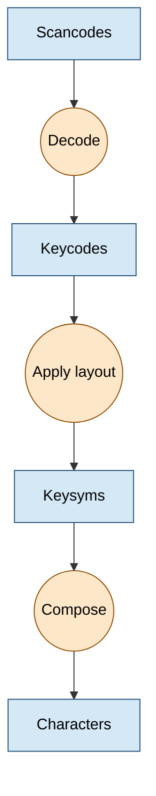
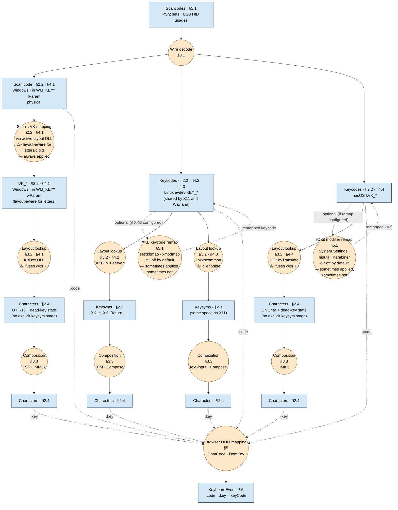
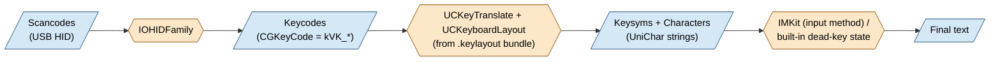
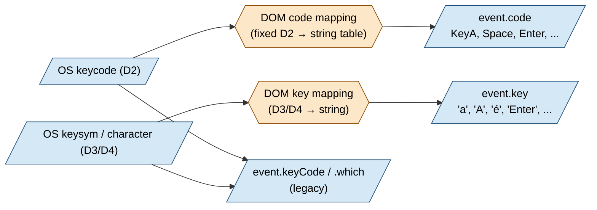
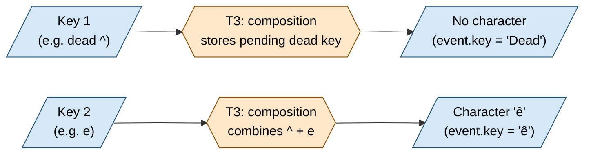

# From Keypress to `KeyboardEvent`: A Full-Stack Trace

This document explains what happens, conceptually, between pressing a key
and receiving a `KeyboardEvent` in JavaScript. It focuses on the
**data model** — the shape of the data flowing through the pipeline —
and on the **transforms** that turn one representation into the next.

## Introduction

A keypress starts as a signal from the keyboard and ends as text in your
document. Between those two ends it takes four different shapes. Each
shape answers a different question, and between them a handful of steps
do the actual translation work.

The four shapes, top to bottom:

- **Scancodes** — keyboard-side abstraction. It is what the keyboard itself reports. Different  keyboards have their own dialects; the same physical key on two  models can produce different signals.
- **Keycodes** — OS-side key-centric abstraction. a stable name for a key ("Enter", "the top-left  letter key"). Everything downstream can talk about keys using these  names without caring which keyboard is plugged in.
- **Keysyms** — OS-side language-aware key-centric abstraction. what is printed on the keycap *under the user's  current layout*. The same key is `q` for someone using a US layout  and `a` for someone using a French layout.
- **Characters** — resulting char after keysym combinations are translated into text

And the three steps between them:

- **Decode** — ironing out each keyboard's dialect into the shared
  naming scheme.
- **Apply layout** — consulting the user's keyboard-layout choice to
  decide what the key means right now.
- **Compose** — combining several keypresses into a single character
  when needed (accented letters, Japanese or Chinese text, etc.).

The rest of this document opens each of these boxes and shows how
Windows, Linux, and macOS implement them, plus how the browser exposes
them to web pages as `KeyboardEvent`s.

---

## 1. Overview

Every keypress passes through four main data representations and three
transforms between them. The rest of the document is an expansion of this
one picture.

**Legend.**

- **Rectangles** (blue) = *data* stages — what is known at that point
  in the pipeline.
- **Circles** (orange) = *transforms* — something that rewrites one
  representation as the next.
- **⚠ warning triangles** mark the few places where an OS deviates
  from the clean four-stage model:

  - **⚠¹ Windows has an always-on scan→VK mapping that is
    layout-aware for letters and digits.** Shown in the diagram as a
    dedicated transform between the **Windows scan code** data node
    (physical, carried in `WM_KEY*` `lParam`) and the **VK_\*** data
    node (carried in `wParam`). For letter and digit keys, `VK_A`
    means "whichever key prints `a` on the active layout", not the
    physical A position; for every other key the mapping is still
    layout-independent. This transform fires for every keypress —
    there is no knob to disable it.

    Because `event.code` needs to stay physical, the browser taps the
    **scan code**, *not* the VK, for `.code` (see the dotted `.code`
    arrow in the diagram). `VK_*` only influences `.key` via the
    downstream `ToUnicodeEx` step. Linux `evdev` and macOS `kVK_*`
    do not have a comparable mandatory transform. Compare with
    ⚠⁴, which is the closest Linux equivalent but only kicks in
    when the user has actively configured XKB to remap keycodes.
    *See §2.2 and §7.3.*

  - **⚠² Windows and macOS fuse layout lookup with composition.**
    `ToUnicodeEx` and `UCKeyTranslate` take a keycode + modifier state
    + a dead-key state word and return a character directly; there is
    no observable keysym stage in between. Linux is the only stack
    where keysyms are a first-class, named data type (`XK_*`).
    *See §3.2.*

  - **⚠³ Wayland runs layout lookup on the client side.**
    The compositor picks the layout and compiles it with
    `libxkbcommon`, then ships the compiled keymap to each client over
    an anonymous memfd. The client re-runs the same library against
    that keymap to produce keysyms. On every other OS layout lookup
    happens once, centrally. *See §4.3.*

  - **⚠⁴ Linux keycodes may be remapped by XKB — sometimes.**
    Shown in the diagram as a *loopback transform* on the Linux
    `evdev` keycode node, drawn with dotted arrows because the loop
    is **conditional**. By default, a keypress flows straight through
    and `event.code` stays strictly physical. But if the user has
    configured XKB to rewrite the keycode table itself — via
    `setxkbmap` options like `ctrl:swapcaps`, or via `xmodmap -e
    "keycode N = ..."` — the loop fires and the browser sees the
    post-remap keycode. In that configuration `event.code` for the
    physical Caps Lock key can come out as `"ControlLeft"`. This is
    the **opposite mode of "always"** from ⚠¹: Windows applies its
    layout-to-VK transform unconditionally for letters/digits, Linux
    applies its XKB remap only when the user asks for it. Ordinary
    layout switches (US → AZERTY → Dvorak) do **not** trigger the
    loop. *See §5.1.*

  - **⚠⁵ macOS keycodes may be remapped by IOKit — sometimes.**
    The macOS counterpart to ⚠⁴, also drawn as a dotted loopback on
    the `kVK_*` node because it is **conditional**. Sources:
    **System Settings → Keyboard → Keyboard Shortcuts → Modifier
    Keys** (the built-in Caps ↔ Control ↔ Option ↔ Command swap),
    the `hidutil property --set '{"UserKeyMapping": ...}'` CLI, and
    third-party tools like Karabiner-Elements that install an IOKit
    HID driver extension. All of these rewrite the key map at the
    HID event level, so the `kVK_*` that lands in an `NSEvent` — and
    therefore in `[NSEvent keyCode]` and in Chromium's `DomCode`
    lookup — is the post-remap code. Pressing physical Caps Lock
    with the built-in Caps → Control swap yields
    `event.code = "ControlLeft"`. **Input-source switching**
    (US → AZERTY → Dvorak) does **not** trigger this loop — it only
    affects `UCKeyTranslate` output downstream, never `kVK_*`.
    *See §5.1.*

- **Section references (§x.y)** turn the diagram into a map of the
  rest of the document — scroll to the listed section for any node's
  details. `§2` covers the data stages, `§3` the transforms, `§4` the
  per-OS pipelines, `§5` the browser, `§6` dead keys / IMEs, `§7`
  worked examples.

Subsequent sections reuse the same shapes (rectangles for data, circles
for transforms), colours, and stage names (**scancodes → keycodes →
keysyms → characters** with transforms **wire decode → layout lookup →
composition**) plus the short labels **D1–D4** / **T1–T3**.

### Why four stages?

Each stage belongs to a different party and answers a different
question:

| Stage             | Whose view?                  | Answers                                       | Knows about                                      |
| ----------------- | ---------------------------- | --------------------------------------------- | ------------------------------------------------ |
| **D1 Scancodes**  | The **keyboard's** view of itself | "Which key in *my* matrix was just pressed?"  | This keyboard's own hardware and protocol        |
| **D2 Keycodes**   | The **OS's** unified view    | "Which key — irrespective of the keyboard?"   | A normalised key namespace shared by all apps    |
| **D3 Keysyms**    | The **user's** view          | "What's printed on the keycap right now?"     | The active layout and modifier state             |
| **D4 Characters** | The **document's** view      | "What text should go into my edit buffer?"    | Dead-key state, compose sequences, IME candidates |

The transforms exist because each stage is *lossy* in the other
direction: you can't reconstruct a physical key from a character ("a"
could be almost any key on some exotic layout) and you can't
reconstruct a character from a physical key without the layout.
Different consumers want different stages — a game wants D2 (where the
key sits), a text editor wants D4 (what to insert), the browser
exposes both (`event.code` vs `event.key`).

---

## 2. The data models

### 2.1 D1 — Scancodes *(on the wire, keyboard-side)*

Scancodes are the **keyboard's view of itself**. The microcontroller
inside the keyboard scans its own key matrix and emits a short byte
sequence for every make (press) and break (release) event; the host
computer just receives those bytes over the wire (PS/2, USB, I²C,
Bluetooth).

Because scancodes describe *this particular keyboard*, historically
they varied with the hardware. No universal "the key codes" existed —
each keyboard family had its own conventions, and the host had to know
how to translate them:

- **PS/2 scancodes** come in three "sets" (Set 1 / XT, Set 2 / AT,
  Set 3), reflecting three generations of IBM keyboards. Set 2 is
  what modern PS/2 keyboards actually emit on the wire; the
  motherboard's i8042 controller usually translates it back to Set 1
  so that the BIOS and legacy software keep seeing the original PC/XT
  codes. Different key groups have different byte lengths (ordinary,
  `0xE0`-prefixed for extended keys, `0xE1`-prefixed for Pause).
  Older or unusual keyboards frequently disagreed on which byte
  represented which key; remapping and per-vendor translation tables
  were the norm.
- **USB HID usage IDs** are a more modern, standardised table (Usage
  Page `0x07` of the HID Usage Tables). Example entries: `0x04 =
  "Keyboard a/A"`, `0x28 = "Keyboard Return"`, `0x14 = "Keyboard
  q/Q"`. Reports also carry a bitmap for the eight modifier keys.
  HID rolled the older per-keyboard disagreement into one fixed table
  — but that table is still anchored to the **US QWERTY physical
  layout**: an AZERTY key in the top-left letter position still
  transmits usage `0x14` ("Keyboard q/Q") even though it is labelled
  `A`. The keyboard literally doesn't know that the user runs AZERTY.

The defining property of D1: the keyboard has no idea what layout is
active on the host. Scancodes name a key by its position in *this*
keyboard's matrix, not by anything the user might recognise on the
keycap. All of the higher-level meaning is imposed host-side.

### 2.2 D2 — Keycodes *(inside the OS, unified across keyboards)*

Keycodes are the **OS's view of a key** — the first abstraction above
the physical hardware. The kernel / HID stack runs a per-keyboard
lookup table (transform **T1**, §3.1) that maps each keyboard's
specific scancodes into one shared namespace that is the same
regardless of which keyboard is plugged in.

The point of this stage is to let applications talk about a key by
its *intent*, not by its wire encoding. A 60 % compact board, a
full-size ANSI keyboard, a Japanese JIS keyboard and a laptop with an
integrated Fn row all disagree on the raw scancodes they produce for
the Enter key. By the time the event reaches userspace, though, every
one of them is reporting the same `VK_RETURN` / `KEY_ENTER` /
`kVK_Return`. Applications can write *"did the user hit Enter?"*
without caring whether it was a cheap USB keyboard or a 1980s PS/2
model — that's the whole job of D2.

Each OS maintains its own keycode namespace:

| OS      | Namespace                                    | Top-left letter key  | Enter key        |
| ------- | -------------------------------------------- | -------------------- | ---------------- |
| Windows | `VK_*` Virtual-Key codes                     | `VK_Q = 0x51` (US)   | `VK_RETURN = 0x0D` |
| Linux   | `evdev` codes (`linux/input-event-codes.h`)  | `KEY_Q = 16`         | `KEY_ENTER = 28` |
| macOS   | `kVK_*` virtual keycodes (`<HIToolbox/Events.h>`) | `kVK_ANSI_Q = 0x0C` | `kVK_Return = 0x24` |

For **non-character keys** — modifiers, arrows, function keys, Enter,
Escape, media keys — D2 is strictly about physical identity. Layout
plays no role: on every OS and every layout, Enter produces the same
keycode. This is what makes keycodes reliable for things like
keyboard shortcuts, games (WASD stays where WASD sits), and
accessibility software.

For **letter and digit keys** there is one quirk: on Windows, `VK_*`
for these keys tracks the active layout, so the physical AZERTY-`A`
key reports `VK_A` rather than `VK_Q` (see **⚠¹** in §1). Linux
`evdev` and macOS `kVK_*` keep letters and digits physical too; only
Windows blurs the line. In the browser, this is exactly the divergence
`event.code` (§5.1) was introduced to paper over — `event.code` is
insensitive to layout switches on all three OSes. (There is one
remaining wrinkle on Linux: XKB can remap at the *keycode* layer, not
just the layout layer, and those remaps do change `.code`. Details in
§5.1.)

### 2.3 D3 — Keysyms *(the user's view, layout applied)*

Keysyms are **the user's view** of a key — what is labelled on the
keycap under the currently active layout. Running a keycode (D2)
through the active layout plus modifier state (transform **T2**,
§3.2) tells you whether this key, right now, means `a`, `A`, `é`,
`Shift`, `Enter`, or "this is a dead key, wait for the next press".

A keysym is either a printable character or a named non-character
key:

- Printable: `a`, `A`, `é`, `°`, `空`.
- Named: `Enter`, `Shift`, `ArrowUp`, `F1`, `Backspace`, `Dead`,
  `Compose`.

D3 is the first stage where **layout matters**. The same physical key
(D2 = `KEY_Q`) becomes keysym `q` on QWERTY, `a` on AZERTY, `'` on
Dvorak. The same physical key becomes keysym `Q` if Shift is held,
because the layout table has a separate column for the shifted level.

Only Linux actually surfaces D3 as a distinct, named data type; the
other OSes blur it into T2:

| OS               | Representation of D3                                                                                       |
| ---------------- | ---------------------------------------------------------------------------------------------------------- |
| X11 / Wayland    | Explicit `keysym` integers (`XK_a = 0x61`, `XK_Return = 0xFF0D`, `XK_dead_circumflex = 0xFE52`), defined in `<X11/keysymdef.h>`. Visible in `xev` output. |
| Windows / macOS  | No separate keysym type. `ToUnicodeEx` / `UCKeyTranslate` step straight from D2 + modifiers to D4 characters in one call (**⚠²** in §1). |

Even where the OS API hides the keysym, the concept still helps: it's
the level at which you can say "this key prints `é`" without yet
worrying about dead-key sequences or IMEs.

### 2.4 D4 — Characters *(what the document actually receives)*

Characters are the **document's view** — the actual text that will be
inserted into an edit buffer (or passed to a terminal, or committed to
a web form). Going from D3 to D4 may be a no-op (press `a`, out comes
`"a"`) or an arbitrarily long stateful process (compose two or three
dead keys; pick a candidate from an IME window).

The transforms contributing to D4:

- A **dead key** (D3 = `Dead`) suppresses immediate output and
  modifies the next keypress's character. Press `^` then `e` on a
  French layout → `ê` is produced on the *second* keypress.
- A **compose sequence** collapses several keysyms into one character.
  On Linux these tables live in
  `/usr/share/X11/locale/*/Compose`; typical entry:
  `Compose + ' + e → é`.
- An **input method** (IME) for Chinese, Japanese, Korean, Vietnamese,
  etc. maps long runs of keys into glyphs, usually after the user
  selects from a candidate popup. The IME is a separate process;
  D1–D3 still flow through the OS normally, but the final D4 character
  is produced by the IME at commit time.

By the time you reach D4 you either have text to insert or a "not
yet, still composing" signal. The browser mirrors this: during an IME
composition, `keydown.key = "Process"` and `keyCode = 229`; the actual
text arrives via `compositionupdate` / `compositionend` / `input`
events (see §6).

---

## 3. The transforms

### 3.1 T1 — Wire decode *(D1 → D2)*

Performed by kernel drivers (USB HID stack, `atkbd` for PS/2, etc.). It
is a **lookup table**: wire byte(s) in, keycode out. It also:

- Tracks **press vs release** (and optionally autorepeat).
- Expands multi-byte scancodes (`0xE0` prefixes etc.) into a single
  code.
- Normalizes vendor quirks (laptop Fn keys, media keys).

Why it exists: downstream code shouldn't care whether the keyboard
spoke PS/2 Set 2 or USB HID. Apps see the same `KEY_Q` (D2) regardless.

### 3.2 T2 — Layout lookup *(D2 → D3)*

Performed by the OS's keyboard-layout subsystem using the currently
active layout:

| OS      | Where the layout lives | Transform API |
|---------|------------------------|---------------|
| Windows | `%SystemRoot%\System32\KBDxx.DLL` (one per layout) | `ToUnicodeEx`, `MapVirtualKey` |
| X11     | `/usr/share/X11/xkb/*` (rules/types/symbols/keycodes) | XKB, `XLookupString` |
| Wayland | Same XKB files, compiled by the compositor and shipped to each client as a memfd | `libxkbcommon` |
| macOS   | `/System/Library/Keyboard Layouts/*.bundle` (`.keylayout` XML) | `UCKeyTranslate` |

The layout is a multi-column table: for every keycode it lists the
keysym produced at each "level" (unshifted, Shift, AltGr, Shift+AltGr,
…). The transform picks a column based on current modifier state.

Why it exists: the physical keyboard is one thing; the user's choice
of layout is another. Decoupling them lets you switch layouts without
swapping keyboards.

### 3.3 T3 — Composition *(D3 → D4)*

Performed by the OS's compose / dead-key machinery or by an IME when
one is active. Composition is **stateful** — it must remember
pending dead keys or in-progress IME candidates across several
keystrokes.

- Dead keys: OS-built-in, driven by the layout file itself.
- Compose sequences: from `Compose` files on Linux, or custom data on
  Windows/macOS.
- IMEs: separate processes (IBus, Fcitx, IMKit, TSF) with their own UI.

Why it exists: many writing systems need more keys than a keyboard has.
Composition lets a finite keyboard produce any Unicode character.

---

## 4. OS-specific pipelines

The big picture (§1) is the same on all three OSes, but the boxes have
different names. Here is each OS projected onto **D1–D4 / T1–T3**.

### 4.1 Windows

```mermaid
flowchart LR
    HID[/"Scancodes<br/>(USB HID / PS/2 Set 1)"/]
    T1W{{"kbdhid.sys / kbdclass.sys<br/>(wire decode)"}}
    VK[/"Keycodes<br/>(VK_*, scan code in lParam)"/]
    T2W{{"Layout DLL (KBDxx.DLL)<br/>ToUnicodeEx / MapVirtualKey"}}
    CH[/"Keysyms + Characters<br/>(UTF-16 strings)"/]
    T3W{{"TSF / IMM32<br/>(compose, dead keys, IME)"}}
    OUT[/"Final text"/]

    HID --> T1W --> VK --> T2W --> CH --> T3W --> OUT

    classDef data fill:#d5e8f6,stroke:#1f4e79,color:#000;
    classDef xform fill:#fde7c9,stroke:#8c4a00,color:#000;
    class HID,VK,CH,OUT data;
    class T1W,T2W,T3W xform;
```

Notes — see **T2** and **D3** in §3.2 / §2.3:

- `WM_KEYDOWN/WM_KEYUP` carry both the **scan code** (in `lParam`, so D1
  is still visible) and the **VK** (`wParam`, which is D2).
- Windows folds D3 and D4 together: `ToUnicodeEx` jumps straight from a
  VK + modifier state to a Unicode string, handling dead keys internally
  via a 256-byte key-state vector.
- Raw Input API (`WM_INPUT`) gives you D1 unmodified if you need it.

### 4.2 Linux / X11

```mermaid
flowchart LR
    HID[/"Scancodes"/]
    T1L{{"Kernel input subsystem<br/>(atkbd, usbhid)"}}
    EV[/"Keycodes<br/>(evdev KEY_*)"/]
    T1X{{"+8 offset"}}
    XKC[/"Keycodes<br/>(X11 keycodes)"/]
    T2L{{"XKB<br/>(rules + types + symbols)"}}
    KS[/"Keysyms<br/>(XK_a, XK_Return, ...)"/]
    T3L{{"XIM / Compose<br/>(dead keys, compose, IME bridge)"}}
    OUT[/"Characters<br/>(Xutf8LookupString result)"/]

    HID --> T1L --> EV --> T1X --> XKC --> T2L --> KS --> T3L --> OUT

    classDef data fill:#d5e8f6,stroke:#1f4e79,color:#000;
    classDef xform fill:#fde7c9,stroke:#8c4a00,color:#000;
    class HID,EV,XKC,KS,OUT data;
    class T1L,T1X,T2L,T3L xform;
```

Notes:

- Linux is the one stack where all four D-stages are **clearly named and
  separate objects** — handy for debugging. `evtest` shows D2, `xev`
  shows both the X keycode (D2 with `+8` offset) and the keysym (D3).
- XKB layouts are composed from four files (rules, types, symbols,
  keycodes); see §3.2 for the table.

### 4.3 Linux / Wayland

```mermaid
flowchart LR
    HID[/"Scancodes"/]
    T1L{{"Kernel input<br/>(same as X11)"}}
    EV[/"Keycodes<br/>(evdev)"/]
    COMP{{"Compositor<br/>picks layout, compiles with libxkbcommon"}}
    KMAP[/"Keymap + wl_keyboard.key events<br/>(shipped to client)"/]
    T2W{{"libxkbcommon (client side)"}}
    KS[/"Keysyms"/]
    T3W{{"Compose / text-input protocol<br/>(IMEs live on the compositor side)"}}
    OUT[/"Characters"/]

    HID --> T1L --> EV --> COMP --> KMAP --> T2W --> KS --> T3W --> OUT

    classDef data fill:#d5e8f6,stroke:#1f4e79,color:#000;
    classDef xform fill:#fde7c9,stroke:#8c4a00,color:#000;
    class HID,EV,KMAP,KS,OUT data;
    class T1L,COMP,T2W,T3W xform;
```

Notes:

- The compositor picks the layout and ships the compiled keymap to each
  client over an anonymous fd; the client runs **T2** itself against
  that keymap (same `libxkbcommon` code, same files as X11).
- IMEs are on the compositor side and talk to clients via a separate
  protocol (`text-input`, `input-method`). From the app's view D3 → D4
  composition happens server-side.

### 4.4 macOS

Notes — `UCKeyTranslate` (see **T2** / **T3**) takes a small dead-key
state word as both input and output, so it spans D3 and the dead-key
part of D4 in one call. IMEs (Kotoeri, Pinyin, etc.) sit in front of the
app and re-enter the pipeline at D4.

---

## 5. The browser

The browser re-exposes the stack to JavaScript. The trick is that it
surfaces **two** of the data models at once, so apps can pick whichever
they need.

### 5.1 `event.code` — the physical view (D2)

Defined by the [UI Events KeyboardEvent code Values](https://www.w3.org/TR/uievents-code/)
spec. A fixed vocabulary of strings like `"KeyA"`, `"Digit1"`, `"Enter"`,
`"ShiftLeft"`, `"IntlBackslash"` drawn from the US ANSI / ISO / JIS
physical keyboard geometry. The mapping from the OS keycode (D2) to this
string is a **fixed table** inside the browser; neither Chromium's
`KeycodeConverter::NativeKeycodeToDomCode`
(`ui/events/keycodes/dom/keycode_converter.cc` →
`dom_code_data.inc`) nor Firefox's `KeymapWrapper::ComputeDOMCodeNameIndex`
(`widget/gtk/nsGtkKeyUtils.cpp`) consults the keysym.

The practical consequence: **switching layouts (US → AZERTY → Dvorak)
does not change `.code`.** Use this for games and any "I care where the
key is" logic.

**Caveat — keycode-layer remaps do change `.code` on Linux and
macOS.** The browser only sees whatever keycode the OS delivers. Two
specific mechanisms can rewrite that keycode before it reaches the
browser:

- **Linux XKB (⚠⁴ in §1).** `setxkbmap -option ctrl:swapcaps` swaps
  the keycodes for the physical Caps Lock and Left Control
  positions; `xmodmap -e "keycode 66 = Control_L"` does the same by
  hand. Either way the browser receives the remapped keycode and
  reports `.code = "ControlLeft"` for physical Caps Lock. Pure
  *layout*-level remaps (changing which keysym each keycode
  produces, e.g. `ctrl:nocaps` through the symbols layer) usually
  leave the keycode alone and so leave `.code` alone, but the
  distinction is subtle and distribution-dependent.

- **macOS IOKit HID (⚠⁵ in §1).** The built-in **System Settings →
  Keyboard → Keyboard Shortcuts → Modifier Keys** panel lets users
  swap Caps Lock, Control, Option, and Command. The equivalent CLI
  is `hidutil property --set '{"UserKeyMapping": [...]}'`. Karabiner-
  Elements uses an IOKit HID driver extension to do richer remaps.
  All of these rewrite the mapping at the HID event level, so
  `[NSEvent keyCode]` — and therefore Chromium's `DomCode` lookup —
  see the post-remap `kVK_*`. Pressing physical Caps Lock with the
  built-in Caps → Control swap yields `.code = "ControlLeft"`.

**Windows has no equivalent knob** exposed to end users through the
GUI. The Registry `HKLM\System\CurrentControlSet\Control\Keyboard
Layout\Scancode Map` value can rewrite scan codes at boot time — this
*would* change `.code` because the browser keys `.code` off the scan
code (see ⚠¹) — but it is not a standard per-user feature.

**What does not change `.code` on any of these OSes:** ordinary
layout/input-source switching (US → AZERTY → Dvorak). That only
affects `.key` via the downstream layout lookup.

Keys the browser has no table entry for (exotic vendor keys, some
multimedia keys) yield `.code = ""`.

### 5.2 `event.key` — the layout view (D3/D4)

Defined by the [UI Events KeyboardEvent key Values](https://www.w3.org/TR/uievents-key/)
spec. Either the character actually produced (`"a"`, `"A"`, `"é"`) or a
named key (`"Shift"`, `"Enter"`, `"ArrowUp"`, `"Dead"`, `"Process"`).
Use this when you care about the letter the user typed.

### 5.3 `event.keyCode` / `.which` — legacy

Deprecated. Roughly tracks Windows VK codes, but implementations differ
across browsers and OSes. Don't use for new code.

### 5.4 Event sequencing

- Press → release produces `keydown` → `keyup`. `keydown` may autorepeat.
- When a character is produced, `beforeinput` and `input` also fire.
- During an IME composition, `keydown` reports `key = "Process"` and
  `keyCode = 229`; the real text arrives via `compositionupdate` /
  `compositionend` / `input`.

---

## 6. Where dead keys and IMEs sit

A dead key is still a real keypress, so it passes through **T1** and **T2**
normally. The difference shows up in **T3**: the composition engine
absorbs it instead of emitting a character.

IMEs behave similarly but on longer, UI-driven sequences. The browser
signals this explicitly: `event.key = "Process"` means "the input method
is handling this; look at composition events instead".

---

## 7. Worked examples

Same physical key (top-left letter block), three scenarios. The columns
correspond to the D-stages in §2.

### 7.1 Physical `A` key, US QWERTY layout active

| Stage | Value |
|-------|-------|
| D1 Scancode | USB HID `0x04` / PS/2 Set 2 `0x1C` |
| D2 Keycode | Windows `VK_A = 0x41` · Linux `KEY_A = 30` · macOS `kVK_ANSI_A = 0x00` |
| D3 Keysym | `a` |
| D4 Character | `"a"` |
| Browser `event.code` | `"KeyA"` |
| Browser `event.key`  | `"a"` |

### 7.2 Shift + same key, US QWERTY active

Two events fire — one for Shift, one for the letter key with the Shift
modifier active. The letter event:

| Stage | Value |
|-------|-------|
| D1–D2 | Unchanged from §7.1 |
| D3 Keysym | `A` (Shift selects the "shifted" column in the layout table) |
| D4 Character | `"A"` |
| Browser `event.code` | `"KeyA"` |
| Browser `event.key`  | `"A"` |
| Browser `event.shiftKey` | `true` |

### 7.3 Physical `Q` key (top-left letter), French AZERTY active

On AZERTY the top-left letter position prints `A`. The *physical* key
there is still what the browser calls `"KeyQ"`.

| Stage | Value |
|-------|-------|
| D1 Scancode | USB HID `0x14` / PS/2 Set 2 `0x15` |
| D2 Keycode | Windows `VK_A` (!) · Linux `KEY_Q = 16` · macOS `kVK_ANSI_Q = 0x0C` |
| D3 Keysym | `a` (layout table says: physical Q column, unshifted level → `a`) |
| D4 Character | `"a"` |
| Browser `event.code` | `"KeyQ"` (physical — unchanged by layout) |
| Browser `event.key`  | `"a"` (layout — says what was typed) |

The Windows row illustrates the caveat from §2.2: Windows lets the
**layout** influence D2 for letter keys, so `VK_A` means "the key that
types `a` on the current layout", not "the physical key at position A".
Linux and macOS keep D2 strictly physical.

### 7.4 Dead key on AZERTY: `^` + `e` → `ê`

See **T3** in §3.3.

| Step | `event.code` | `event.key` |
|------|--------------|-------------|
| Press `^` (dead) | `"BracketLeft"` | `"Dead"` |
| Press `e`        | `"KeyE"` | `"ê"` |

The OS has stored "pending circumflex" between the two keypresses;
the browser sees it as `Dead` followed by the composed character.

---

## 8. References

Specifications
- W3C UI Events: https://www.w3.org/TR/uievents/
- W3C UI Events KeyboardEvent code Values: https://www.w3.org/TR/uievents-code/
- W3C UI Events KeyboardEvent key Values: https://www.w3.org/TR/uievents-key/
- USB HID 1.11: https://www.usb.org/document-library/device-class-definition-hid-111
- USB HID Usage Tables: https://usb.org/document-library/hid-usage-tables-15

Windows
- Virtual-Key Codes: https://learn.microsoft.com/en-us/windows/win32/inputdev/virtual-key-codes
- Keyboard Input: https://learn.microsoft.com/en-us/windows/win32/inputdev/keyboard-input
- `MapVirtualKeyExW`: https://learn.microsoft.com/en-us/windows/win32/api/winuser/nf-winuser-mapvirtualkeyexw
- `ToUnicodeEx`: https://learn.microsoft.com/en-us/windows/win32/api/winuser/nf-winuser-tounicodeex

Linux
- `linux/input-event-codes.h`: https://git.kernel.org/pub/scm/linux/kernel/git/torvalds/linux.git/tree/include/uapi/linux/input-event-codes.h
- XKB protocol: https://www.x.org/releases/X11R7.7/doc/kbproto/xkbproto.html
- `xkeyboard-config`: https://gitlab.freedesktop.org/xkeyboard-config/xkeyboard-config
- libxkbcommon: https://xkbcommon.org/

macOS
- `<HIToolbox/Events.h>` kVK constants: https://developer.apple.com/library/archive/samplecode/HIDExplorer/
- `UCKeyTranslate`: https://developer.apple.com/documentation/coreservices/1390592-uckeytranslate
- TN2056 (keyboard layout format): https://developer.apple.com/library/archive/technotes/tn2056/

Browsers
- Chromium key event internals: https://source.chromium.org/chromium/chromium/src/+/main:ui/events/keycodes/
- WebKit `WebKeyboardEvent`: https://github.com/WebKit/WebKit/tree/main/Source/WebCore/platform

Reference keyboard-event inspectors
- https://w3c.github.io/uievents/tools/key-event-viewer.html
- https://keyjs.dev
- https://keycode.info
