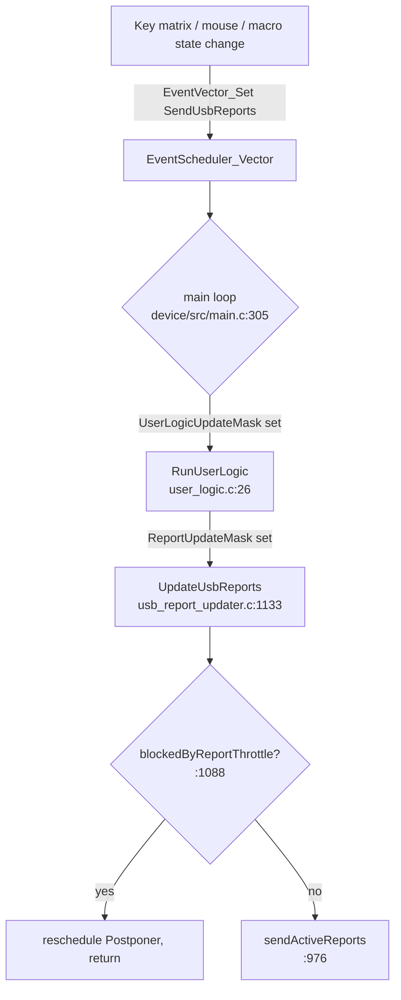
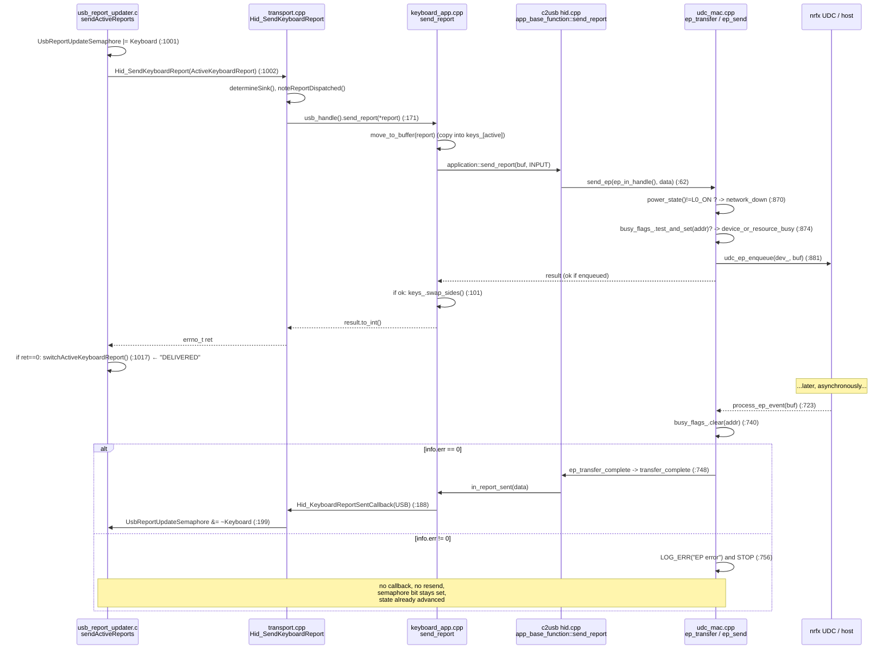
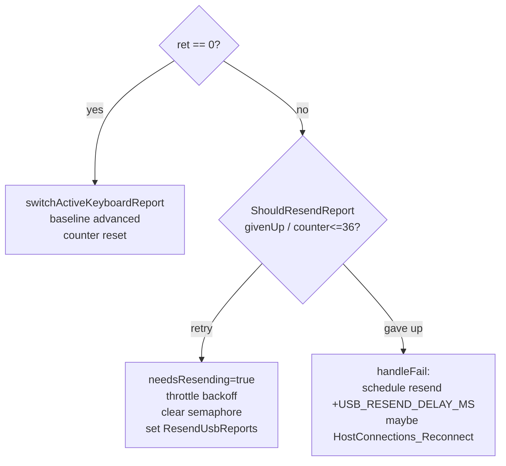
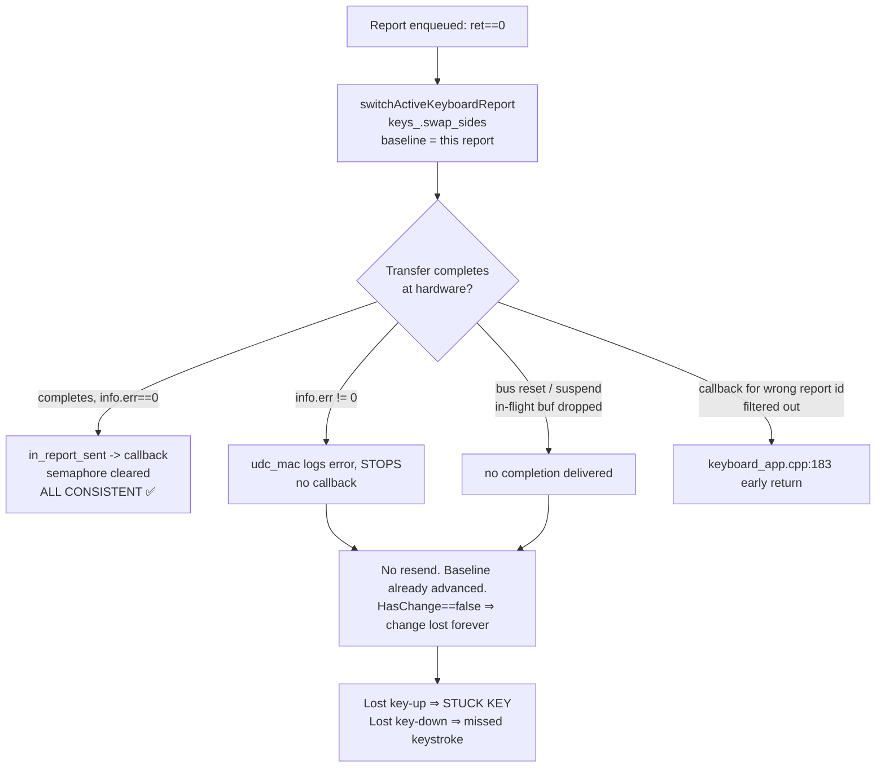

# USB/HID report path and the "stuck keys" failure modes

> Status: investigation / hypothesis document
> Context: since 12.0.0 the firmware switched to *reactive* report processing
> (reports are constructed and sent only when state changes). Since then we get
> sporadic reports of stuck keys. The working hypothesis is that **a report is
> accepted by the firmware as "delivered" but never actually reaches the host**,
> and because nothing re-sends the current state, the discrepancy is permanent.
>
> This document maps the full report path and pinpoints where that can happen.

## TL;DR — the core finding

A keyboard/mouse/controls report is considered **delivered the moment the
transport *accepts* (enqueues) it**, not when the host actually acknowledges it.

- `Hid_SendKeyboardReport()` returns `0` as soon as the report is enqueued onto
  the USB interrupt-IN endpoint (`udc_ep_enqueue()` returned `0`).
- On that `ret == 0`, the report updater **advances its "last sent" state**
  (`switchActiveKeyboardReport()`), and c2usb advances its own double buffer
  (`keys_.swap_sides()`).
- The actual transfer completion (`info.err`) is handled **asynchronously and
  separately**. If the transfer later fails or is dropped (bus reset, suspend,
  EP error, hub glitch), the completion callback (`in_report_sent` →
  `Hid_KeyboardReportSentCallback`) **never fires**, and there is **no rollback
  and no resend** — because the state already advanced, `*_HasChange()` returns
  false and the lost change is never retransmitted.

Under the **old periodic model** the same report was effectively re-sent every
polling cycle, so a single dropped report self-healed on the next cycle. The
reactive model removed that implicit redundancy, which is why the symptom
appeared at 12.0.0.

A lost **key-up** report ⇒ host believes the key is still held ⇒ **stuck key**.
A lost **key-down** report ⇒ missed keystroke.

---

## 1. The reactive trigger (what causes a send)

Reports are only built/sent when an `EventVector_SendUsbReports` /
`EventVector_ResendUsbReports` bit is set in the event scheduler. There is **no
periodic "re-send current state" tick** — every send is edge-triggered by an
actual state change (key matrix, mouse, macros, …).



> Note (UHK80 vs UHK60): the **UHK60** main loop gates `RunUserLogic()` behind
> `UsbReadyForTransfers()` (`right/src/main.c:261`), which has a 100 ms semaphore
> timeout reset. The **UHK80** main loop (`device/src/main.c:305`) does **not**
> consult `UsbReportUpdateSemaphore` at all — it runs whenever the
> `UserLogicUpdateMask` is set. So on UHK80 the semaphore is not a send gate;
> overlap is instead prevented by the per-report "has change" comparison plus the
> transport-level busy/retry path.

---

## 2. Change detection and double buffering

Whether a report is sent at all is decided by comparing the active report to the
last-sent report:

- `KeyboardReport_HasChange()` — `right/src/hid/keyboard_report.c:134`
  (`memcmp` of `keyboardReports[0]` vs `keyboardReports[1]`).
- `MouseReport_HasChanges()` — `right/src/hid/mouse_report.c:18` (memcmp **or**
  any pending movement).
- `ControlsReport_HasChanges()` — `right/src/hid/controls_report.c`.

The "last sent" state is represented by a 2-slot buffer with an active pointer
(`usb_report_updater.c:109`):

```c
static hid_keyboard_report_t keyboardReports[2];
hid_keyboard_report_t *ActiveKeyboardReport = &keyboardReports[0];
// switchActiveKeyboardReport() flips ActiveKeyboardReport between [0] and [1]
```

`switchActiveKeyboardReport()` is the act of declaring "the previous active
report is now the confirmed baseline". **This is the firmware's notion of
"delivered".** It is called only on `ret == 0` (see §4).

c2usb keeps a *second*, independent double buffer per app
(`keyboard_app::keys_`, `mouse_app::report_buffer_`, …) that protects the
in-flight DMA buffer; it `swap_sides()` **only on `result::ok`**
(`keyboard_app.cpp:101`, `mouse_app.cpp:30`, `controls_app.cpp:29`).

---

## 3. The transmit path (UHK80 / USB)



Key code anchors:
- `right/src/hid/transport.cpp:163` `Hid_SendKeyboardReport` (sink select + dispatch)
- `right/src/hid/keyboard_app.cpp:82` `keyboard_app::send_report`
- `c2usb .../usb/df/class/hid.cpp:46` `app_base_function::send_report`
- `c2usb .../port/zephyr/udc_mac.cpp:855` `ep_transfer` / `:889` `ep_send`
- `c2usb .../port/zephyr/udc_mac.cpp:723` `process_ep_event` (completion)
- `right/src/hid/keyboard_app.cpp:180` `in_report_sent`
- `right/src/hid/transport.cpp:197` `Hid_KeyboardReportSentCallback`

---

## 4. Error handling in `sendActiveReports` (the synchronous return code)

`right/src/usb_report_updater.c:984` (keyboard; mouse/controls are analogous):

```c
UsbReportUpdateSemaphore |= UsbReportUpdate_Keyboard;          // :1001
ret = Hid_SendKeyboardReport(ActiveKeyboardReport);           // :1002
if (ShouldResendReport(ret == 0, &keyboardRetries)) {          // :1003  (ret!=0 -> maybe retry)
    reportRetry(ret);
    keyboardNeedsResending = true;
    retryThrottleTime = now + GetResendThrottleDelay(keyboardRetries);
    UsbReportUpdateSemaphore &= ~UsbReportUpdate_Keyboard;      // :1009
    EventVector_Set(EventVector_ResendUsbReports);              // :1010
} else {
    if (ret != 0) {
        handleFail(ret);                                       // :1013  gave up after retries
    } else {
        switchActiveKeyboardReport();                          // :1017  SUCCESS -> advance baseline
    }
    keyboardNeedsResending = false;
}
```

Decision table for the **synchronous** return:



This path is **correct for synchronous failures** (endpoint busy, not connected,
power down): it either retries (≤36 attempts, exp. backoff to ~1 s total) or
gives up and reschedules. On give-up it does *not* advance the baseline, so the
state is retried later. Good.

**The gap is everything that happens after `ret == 0`** — see §5.

---

## 5. Failure modes where a report is "delivered" but never arrives



### FM1 — Asynchronous transfer error (primary suspect)
`udc_mac::process_ep_event` (`udc_mac.cpp:742`) only calls
`ep_transfer_complete` when `info.err == 0`. On `info.err != 0` it just
`LOG_ERR`s (`:756`) and returns. Consequences:
- the in-report-sent callback never fires for that report;
- the report-updater has *already* advanced the baseline at submission time;
- nothing reconciles host vs device state ⇒ the change is permanently lost.

This is the cleanest match for the hypothesis: the firmware marked the report
delivered (enqueue succeeded), but the actual transfer failed later.

### FM2 — Bus reset / suspend / re-enumeration while a report is in flight
On a USB reset or suspend, an enqueued interrupt-IN transfer can be discarded by
the controller without a normal completion. The `CONFIGURATION_CHANGE` handler
(`transport_usb.cpp:136`) clears `UsbReportUpdateSemaphore = 0`, but it does
**not** roll back `ActiveKeyboardReport` / `keys_` and does **not** trigger a
re-send of the current state. Whatever was in flight (and already treated as
baseline) is lost.

### FM3 — Stuck semaphore bit (latency/secondary, UHK80)
If the completion callback is lost (FM1/FM2), `UsbReportUpdateSemaphore` keeps
its bit set. On **UHK60** `UsbReadyForTransfers()` self-heals this after
`USB_SEMAPHORE_TIMEOUT` (100 ms). On **UHK80** there is no equivalent reset of
the semaphore on the send path (only `CONFIGURATION_CHANGE` resets it). Because
UHK80 does not gate sending on the semaphore, this is mostly a latency-stats /
diagnostics concern rather than a direct send blocker — but it does mean the
semaphore can no longer be trusted as an "in flight" indicator on UHK80.

### FM4 — Completion callback delivered for a filtered report id
`keyboard_app::in_report_sent` (`keyboard_app.cpp:180`) returns early for report
ids that are not the keyboard ids in REPORT protocol. This is intended (the
shared endpoint can carry boot vs nkro vs 6kro), but is worth keeping in mind:
the semaphore-clear is keyed off the *callback firing*, so any mismatch between
which report was enqueued and which completion is observed can skew the
bookkeeping. Worth auditing under protocol/rollover switches (`set_rollover`,
`reset_keys`).

### FM5 — No periodic safety re-send
There is no heartbeat that periodically re-asserts the current key/mouse state.
Every send is edge-triggered. Therefore **any** single lost report (FM1–FM2) is
unrecoverable until the *next* genuine state change on that exact report — which,
for a stuck modifier or a held key, may never come.

---

## 6. Shared gating across transports (BLE / dongle)

The same `sendActiveReports` logic drives all sinks
(`determineSink()`, `transport.cpp:108`):

- **USB**: `keyboard_app::usb_handle().send_report` (this document's focus).
- **BLE HID** (UHK80 right): `keyboard_app::ble_handle().send_report`; completion
  via the c2usb Zephyr BLE HID `in_report_sent`. Same "advance baseline at
  submission" semantics, so FM1/FM2/FM5 apply analogously (a BLE notification
  accepted by the stack but not delivered).
- **Dongle (NUS)**: `Messenger_Send2(...SyncablePropertyId_KeyboardReport...)`;
  the "sent" signal arrives via `HidTransport_NoteNusReportSent`
  (`transport.cpp:103`). Here `ret` reflects the messenger enqueue, not host
  receipt, so the same class of issue exists across the RF link.

The NKRO→6KRO fallback (`keyboard_app.cpp:91`, BLE-only, on
`not_enough_memory`) is a notable extra branch but returns a normal result and
is consistent with the baseline-advance logic.

---

## 7. Where to intervene (candidate fixes — not yet implemented)

These are options to discuss, not decisions:

1. **Advance the baseline on completion, not on enqueue.** Only call
   `switchActiveKeyboardReport()` / `swap_sides()` from the sent callback. This
   makes "delivered" mean "host acknowledged" and lets a failed/never-completed
   transfer be naturally retried by `*_HasChange()`. Cost: needs the in-flight
   report buffered separately and care around overlap.
2. **Surface async completion errors back to the report layer.** Have
   `udc_mac::process_ep_event`'s `info.err != 0` path (and BLE's equivalent)
   notify the updater so it can re-arm `EventVector_(Re)SendUsbReports` and not
   treat the report as delivered.
3. **Reconcile on reset/suspend.** On `CONFIGURATION_CHANGE` (and BLE
   reconnect), force a re-send of the current keyboard/mouse/controls state
   instead of only clearing the semaphore.
4. **Add a low-rate safety heartbeat** that re-asserts current state when any
   key/button is held (cheap insurance restoring the old model's redundancy
   without its full bandwidth).
5. **Restore a semaphore watchdog on UHK80** equivalent to UHK60's
   `UsbReadyForTransfers()` timeout so a lost callback cannot leave stale
   bookkeeping.

---

## Appendix — file/line index

| Concern | Location |
|---|---|
| Reactive send trigger | `right/src/usb_report_updater.c:1133` `UpdateUsbReports` |
| Throttle gate | `right/src/usb_report_updater.c:1088` `blockedByReportThrottle` |
| Send + sync error handling | `right/src/usb_report_updater.c:976` `sendActiveReports` |
| Baseline advance ("delivered") | `right/src/usb_report_updater.c:1017` `switchActiveKeyboardReport` |
| Retry policy | `right/src/usb_report_updater.c:894` `ShouldResendReport` / `:921` backoff |
| Give-up handling | `right/src/usb_report_updater.c:952` `handleFail` |
| Change detection | `right/src/hid/keyboard_report.c:134`, `mouse_report.c:18` |
| Dispatch / sink select | `right/src/hid/transport.cpp:163`, `:108` |
| Sent callbacks (clear semaphore) | `right/src/hid/transport.cpp:197`, `:243`, `:286` |
| App send + double buffer | `right/src/hid/keyboard_app.cpp:82` / `:180` |
| HID class send | `c2usb .../usb/df/class/hid.cpp:46`, completion `:87` |
| Endpoint enqueue | `c2usb .../port/zephyr/udc_mac.cpp:855` / `:889` |
| Endpoint completion (error swallow) | `c2usb .../port/zephyr/udc_mac.cpp:723` (err path `:756`) |
| Semaphore reset on reconfig | `right/src/hid/transport_usb.cpp:136` |
| UHK60-only semaphore watchdog | `right/src/main.c:126` `UsbReadyForTransfers` |
| UHK80 main loop (no semaphore gate) | `device/src/main.c:305` |
</content>
</invoke>
