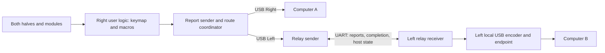

# Technical design: UHK80 switching between two wired USB hosts

**Status:** Experimental firmware implementation complete; hardware validation pending.

**Build, flashing and test instructions:**
[Development guide](uhk80-dual-usb-hosts-development.md).

**Date:** 2026-10-09

**Requirements:** [Dual-USB host PRD](uhk80-dual-usb-hosts-prd.md).

**Source baseline:** `leadZERO/UHK-Firmware` at
`0bc7edb864e675f6914583edba26d5d6d0a45abf`.

The sections below record the implementation design. The implementation uses
`usb_left_relay_uhk.h` for the coordinator/platform API and a dedicated
`right/src/hid/usb_left_adapter.cpp` for transfer ownership and local encoding.
USB submission/cancellation runs on the c2usb worker; lifecycle fences drain
callbacks before reusing storage. UART transmission uses a bounded worker queue.
Queued USB reservations remain owned until replaced by endpoint transfers.

The report retry/deadline are provisionally 32/128 ms. A transition with no
proven old-transfer drain remains blocked after the bounded macro barrier;
link loss and elapsed time alone cannot establish safe quiescence. Suspended
USB hosts retain neutral-report debt after a proven drain. These refinements
take precedence over the draft timeout assumptions below. Timing and runtime
memory budgets still require hardware measurement. The implementation and
initial hardware tests are firmware-only; Agent configuration support follows
separately.

## 1. Decisions

1. Keep the right half as the sole keymap, layer, macro, and host-selection
   controller. Forward complete processed reports to the left USB endpoint.
2. Keep both USB devices enumerated. Selection gates input, not enumeration or
   the vendor-command interface.
3. Implement the new relay over the **wired UART bridge only** in version 1.
   Existing inter-half BLE key/state traffic continues unchanged. Removing the
   bridge makes USB Left unavailable for relay input; it does not redirect input
   to USB Right. Relay over inter-half BLE can be added later using the same
   application protocol after testing its ordering and timing.
4. Introduce a versioned relay message family with fresh session tokens,
   per-report sequence numbers, bounded buffering, and USB completion results.
5. Perform host changes involving USB Left through an asynchronous transition
   coordinator. Release old-host state, invalidate old reports, then commit the
   new input route.
6. Provision an optional USB Left host slot in RAM for development. Use existing
   USB flashing, macro execution, and shell/log tools without changing Agent.
7. Preserve serialized host types, USB VID/PIDs, existing descriptors, and the
   bootloader. Do not change the PC-facing configuration format for the relay.

The UART-only decision narrows the PRD's optional alternate-route behavior: the
first release demonstrates the fully wired setup and does not claim a new BLE
relay fallback. It preserves existing BLE/dongle operation and ordinary left-to-
right key scanning over their existing routes.

## 2. Current code and architecture

- `device/src/main.c` calls `USB_Enable()` on both halves. Shared USB
  configuration includes keyboard, mouse, controls, and vendor-command HID
  functions.
- The left runs `RunUhk80LeftHalfLogic()` and sends compressed scan state. The
  right runs `RunUserLogic()` and builds full input reports.
- `HostConnectionType_UsbHidLeft = 2` exists. Left alias resolution, remote USB
  availability, and the corresponding report sink are incomplete.
- `Hid_Send*Report()` already forwards reports to the dongle. The left receiver
  does not accept these report properties.
- The sender sets per-kind `UsbSemaphore` in-flight state. Completion advances
  the corresponding report double buffer. The dongle path releases it upon
  Messenger acceptance; USB/BLE normally use asynchronous callbacks.
- `UsbSemaphore_RecalculateIsReady()` has a generic 32 ms confirmation timeout.
  Its source comment acknowledges that duplicate confirmations can advance the
  wrong report. The relay must not inherit untagged retry/completion behavior.
- c2usb's HID callback passes `t.transferred_size()` to `report_sent()`. A
  cancelled/failed transfer produces an empty span. Current UHK callbacks ignore
  the span and release the semaphore; a relay ACK must validate success.



## 3. Components and ownership

| Proposed component | Responsibility |
| --- | --- |
| `device/src/usb_left_relay.c/.h` | Right sender and left receiver state machines, handshake, wire validation, fixed report slots, retransmission, leases, and diagnostics. Compile role-specific portions on the relevant half. |
| `device/src/usb_left_relay_protocol.c/.h` | Explicit byte codecs, protocol constants, payload sizes, and message validation; no compiler struct ABI on the wire. |
| `device/src/host_route.c/.h` | Transition coordinator, explicit destination snapshots, input generation, drain/release deadlines, and completion of host changes involving USB Left. |
| `right/src/hid/transport.cpp` | Add `ReportSink_UsbLeft`; separate destination selection from local USB encoding/submission and match local USB completion tickets. |
| Existing sender/updater/semaphore | Integrate relay-owned retries/completion, generation changes, input suppression, and clearing of old report state. |
| Existing connections/USB/power/widget code | Resolve the left host slot, publish remote state, preserve existing selection policy, and show actual selected-host state. |

The main event loop owns relay/transition state and report baselines. USB
callbacks publish bounded completion/lifecycle records and wake the loop. They
must not block, retry, call Messenger, run host selection, or swap the right's
report buffers directly for the relay path.

Use fixed per-kind completion mailboxes, protected by a short Zephyr spinlock or
equivalent ISR-safe mechanism. Tickets cannot be reused until endpoint quiescence
is established. Unexpected mailbox reuse is a fault, not an overwritten event.
USB/state callbacks may coalesce host snapshots but may not lose a completion.

The left's `Relay_Process()` runs after Messenger processing and before
`scheduleNextRun()`. The right services relay and transition work before normal
report production. Add explicit scheduler events/deadlines that wake either loop
even when no key changes occur. Do not put a sleep/retry loop in `receiveLeft()`.

## 4. Host identity, state, and lifecycle

### Local and remote USB state

Keep a local USB state record per half and a cached remote-left record on the
right. The record includes:

- USB generation and monotonically increasing state revision.
- Configured/transport-up, suspended, and remote-wakeup permission flags.
- Keyboard protocol and rollover, LED bits, effective vertical/horizontal scroll
  multipliers, and local Windows-host detection where relevant.

Expose host-armed remote-wakeup permission through the local USB transport
adapter; do not infer it merely from the descriptor's advertised capability.
Maintain relay-active/fault flags in snapshots for detecting expired or failed
activation independently of USB enumeration.

Publish configured/ready only after the relevant composite input sessions exist;
the keyboard application's early transport-up callback alone is insufficient.

Increment the USB generation on endpoint/session teardown or replacement,
including bus reset/reconfiguration and keyboard protocol session recreation.
Publish state after the new session object exists. Coalesce successive startup
events into one snapshot, but invalidate the active relay immediately on teardown.

Update `usb_state.c` to identify the local port: right publishes USB Right; left
publishes local USB Left and notifies the relay. The right derives the configured
left host's state from the remote snapshot and verified UART/capability state.

| Left conditions known to right | Connection state | Product state |
| --- | --- | --- |
| UART/capability unavailable, stale peer, or USB not configured | Disconnected | Unavailable |
| Compatible UART peer and configured left USB, suspended | Connected | Sleeping |
| Compatible UART peer and configured left USB, awake | Ready | Ready for selection |

Report activation is separate from connection availability: the left can be
Ready while inactive, but reports require a completed `BEGIN` transaction.
`nextActive` continues using Ready slots; a sleeping left host can be selected
explicitly and woken. Preserve the existing explicit-offline selection policy
and configured automatic fallback; do not introduce a new fallback rule.

### Alias and feedback changes

Add `ConnectionId_UsbHidLeft` alias resolution on the **right** to the single
configured left slot. Local left USB state remains local and does not require
the left to have the right's complete host configuration. If no slot exists, do
not publish Ready into an arbitrary slot. Re-evaluate aliases after configuration
application, provisioning, reordering, and deletion.

Replacing configuration or removing/changing an active host slot is also a route
barrier. Capture and close the active route before publishing the new table,
then re-resolve aliases and activate from fresh state. Invalid/dry-run
configuration must not modify committed relay state.

Reject duplicate USB Left slots on a new configuration; diagnose existing
duplicates and disable this destination rather than choose an ambiguous slot.
Preserve existing handling of right USB and reserved backup/template slots.

Apply cached left LEDs and scroll multipliers only while USB Left is selected.
Keep inactive feedback cached. The existing dongle-only LED state-sync direction
remains unchanged; the new relay family carries left host state separately.
`Connections_IsCurrentHostAwake()` uses remote-left state on the right.

### Power and updates

Suspend gates user input. A selection or fresh input can request permitted wakeup;
failed/denied wakeup retains the selection and discards input. Resume starts a
fresh relay session before accepting new input. Do not replay the waking input
or held inputs accumulated during suspension. Existing system-control HID wake
actions remain distinct from USB remote-wakeup requests.

Keep the UART link serviced while a selected awake left host requires it. Deep
sleep entry first invalidates the relay and requests neutral state; do not sleep
the link underneath an active lease. On wake, perform handshake/session setup
again. The left also clears on lease expiry if the right disappears unexpectedly.

Firmware re-enumeration terminates the relay, clears state where possible, and
keeps vendor-command/bootloader update behavior intact. Do not reject management
commands merely because that USB endpoint is inactive for keyboard input.

## 5. Relay protocol version 1

### Transport and negotiation

Append `MessageId_UsbRelay = 8` to the existing Messenger message family; verify
the allocation is still free when implementing. Existing numeric values do not
change. Use one message ID plus a relay opcode, not the legacy report-property
format, because those reports lack session and completion identity.

Add a proposed `Messenger_SendVia()` for a single message ID on an explicit
connection. It wraps the existing `Messenger_SendMessage()`; use UART Left on
the right and UART Right on the left. Never allow this family to choose BLE or a
host/dongle connection implicitly.

Preserve the ingress connection ID in the Messenger queue record and propagate
it to the new dispatcher. Currently the queue preserves the source device but
not its connection. Validate direction, source/destination device, and the paired
UART connection before decoding. Verify the outer length before reading IDs.
The old message paths keep their existing dispatch behavior.

Every relay payload begins with `version:u8, opcode:u8`. Integers are explicitly
little-endian; no bitfields, native enums, floats, or pointers are serialized.
Unsupported versions/lengths/opcodes have no side effects and produce a bounded
diagnostic. Numeric opcode allocation is local to version 1:

| Opcode | Direction | Body after the 2-byte prefix |
| --- | --- | --- |
| 1 `HELLO` | Right → Left | `right_boot:u64, schema:u32, capabilities:u32` |
| 2 `HELLO_ACK` | Left → Right | `right_boot:u64, left_boot:u64, challenge:u64, usb_generation:u32, schema:u32, capabilities:u32, state:13 bytes` |
| 3 `STATE` | Left → Right | `right_boot:u64, left_boot:u64, challenge:u64, usb_generation:u32, state:13 bytes` |
| 4 `BEGIN` | Right → Left | `right_boot:u64, left_boot:u64, challenge:u64, expected_usb_generation:u32, selection_generation:u32, token:u64` |
| 5 `BEGUN` | Left → Right | `token:u64, selection_generation:u32, usb_generation:u32, status:u8` |
| 6 `REPORT` | Right → Left | `token:u64, sequence:u32, kind:u8, canonical_report:kind-dependent bytes` |
| 7 `DONE` | Left → Right | `token:u64, sequence:u32, kind:u8, status:u8` |
| 8 `END` | Right → Left | `rightBoot:u64, leftBoot:u64, challenge:u64, selection:u32, token:u64` |
| 9 `ENDED` | Left → Right | `token:u64, status:u8` |
| 10 `WAKE_REQUEST` | Right → Left | `right_boot:u64, left_boot:u64, challenge:u64, expected_usb_generation:u32, selection_generation:u32` |
| 11 `HEARTBEAT` | Right → Left | `token:u64, counter:u32` |
| 12 `FAULT` | Left → Right | `token:u64, reason:u8` |

The 13-byte state contains `revision:u32, flags:u16, leds:u8, protocol:u8,
rollover:u8, vertical_multiplier:u16, horizontal_multiplier:u16`. Reserve flag
bits explicitly for configured, suspended, wakeup-permitted, Windows-host,
relay-active, and relay-faulted state; reject unsupported reserved bits in
version 1. Send effective integral
multipliers, preserving the existing Windows workaround at the left endpoint.

Use boot nonces and a fresh handshake challenge to bind activation to both
running halves. Generate a fresh nonzero 64-bit token for each activation; this
is stale-session identity, not authentication or a security credential.
`BEGIN` additionally binds the current left USB generation and increasing right
selection generation. An old `BEGIN`, `END`, `DONE`, or report cannot affect a
newer active session. Repeated control messages for the same transaction are
idempotent. Retain a closed-session tombstone for retransmitted `END` responses.
An END for an unseen BEGIN fences its selection generation before acknowledging
closure, so a delayed BEGIN cannot reopen the closed transaction. END validates
the peer boot/challenge but permits closing across a changed USB generation.

The right starts negotiation when UART becomes ready. The new left remains
passive with an old right. An old left receives an unknown message ID and cannot
enable the feature; keep probes bounded and diagnose incompatibility once per
link attempt. Stop probing after three unanswered attempts until a fresh link
or explicit retry. A failed handshake disables only USB Left.

Allocate capability bits 0/1/2 to keyboard/mouse/controls, bit 3 to wake requests,
and bit 4 to complete host feedback. Intersect peer capability masks. A
keyboard-only prototype advertises only implemented functionality; a release
peer must support all three input kinds and host feedback. USB transfer/session
guards are mandatory in version 1, not optional capabilities.

### Canonical reports and bounds

| Kind | Version-1 encoding |
| --- | --- |
| 1 Keyboard | Modifier byte plus 28-byte usage bitmap for the baseline usage range `0x04..0xDD`; unused trailing bitmap bits are zero. Total 29 bytes. |
| 2 Mouse | 24 button bits as 3 little-endian bytes, then signed LE16 `x, y, wheelY, wheelX`. Total 11 bytes. |
| 3 Controls | Four LE16 consumer usages followed by two system-usage bytes. Total 10 bytes. |

Negotiate a fixed schema identifier covering usage range, report lengths, and
encoding. Add compile-time checks against current report definitions. A future
layout change requires a new negotiated schema; matching native `sizeof` alone
is insufficient. Decode into owned aligned storage and then convert to local
HID types; never cast an unaligned incoming buffer to a report struct.

Messenger adds 3 addressing/watermark bytes and 1 message-ID byte. A keyboard
`REPORT` is therefore **48 bytes before UART framing**: 4 outer + 2 prefix +
8 token + 4 sequence + 1 kind + 29 report. `HELLO_ACK` is 55 bytes including the
outer header; all version-1 messages fit the 128-byte limit. Assert the bound
for every opcode and validate exact lengths, kind, report ranges, and schema
before accepting a packet.

### Activation and lease

`BEGIN` is accepted only for the negotiated peer/challenge, current awake USB
generation, and a newer selection generation. First invalidate/drain any old
relay session, then deliver neutral keyboard, mouse, and controls reports.
Return `BEGUN(success)` only when those transfers succeed. Duplicate BEGIN must
not resubmit neutrals or reset sequence numbers after activation.

During activation, send a fresh HEARTBEAT counter every 200 ms. Reports and
new valid heartbeat counters refresh a 700 ms left lease. Duplicates do not
extend it. On expiry, invalidate the token immediately, discard pending user
reports, cancel/drain transfers, and clear held USB state. The proposed 1-second
PRD target leaves 300 ms after lease expiry for cleanup; measure both phases.
STATE is sent on changes and periodically while the peer is negotiated so loss
of a feedback packet does not leave the right with indefinitely stale state.

Rotate the challenge on each new UART link generation and clear cached handshake
transactions for the old link. Retain that ingress generation as well as the
connection ID in Messenger queue metadata; reject packets queued before a
disconnect even if the same connection ID is subsequently ready again.
Return STATE to active heartbeat requests, coalescing redundant snapshots, and
publish an expired/faulted activation immediately. Bound periodic inactive state
refresh initially to 500 ms. Handle state-revision wrap by re-negotiation.

## 6. Report delivery and bounded retries

Keep **one outstanding report per kind** on each half. The right copies an
immutable canonical report, allocates that kind's next sequence starting at 1,
and retains it until DONE or session abort. Use the existing sender gate to
apply backpressure rather than creating an unbounded relay FIFO.

`Hid_Send*Report()` returns 0 after ownership moves into the relay slot. It does
not release `UsbSemaphore`. The right releases that kind exactly once when a
matching DONE(success) is processed for the active token/sequence and the
original pending baseline. Record scheduler completion at that point, with a
relay-specific interval estimate rather than a BLE connection estimate.

The left validates token and next expected sequence, copies the canonical/side
report into its fixed slot, and submits via an explicit local USB encoder.
It never calls a function that re-selects a host destination. Local encoding
uses the left's USB session protocol and rollover; the right's USB protocol
cannot alter the relay's canonical keyboard format.

Determine the sink before calling the right's `key_report_buffer::insert()`;
the relay branch does not need or own that local encoded buffer. Each endpoint
keeps its own rollover setting. Explicit local rollover changes may use the
existing reconfiguration behavior, but host selection itself never calls
`USB_Reconfigure()` or changes the descriptor.

Duplicate processing rules:

- Duplicate of an in-flight sequence: retain the original submission; do not
  submit again and do not claim successful delivery.
- Duplicate of the last completed sequence with matching payload identity:
  resend cached DONE without USB submission.
- Reused sequence with different payload, skipped/future sequence, old token,
  or old USB generation: reject; a conflicting sequence faults the session.
- ACK received twice: only the first matching completion advances the right
  baseline. A DONE from an older generation cannot release a new semaphore.

The generic 32 ms semaphore timeout must delegate relay pending work to the
relay; it must not rebuild a relative mouse report or allocate a new sequence.
Start with 32 ms retransmission intervals and three retransmissions of the same
immutable REPORT. Re-evaluate after measurements. Messenger busy errors retain
ownership and consume the bounded deadline without allocating another slot.
An exhausted deadline aborts the session and marks the route unavailable rather
than calling the generic Bluetooth reconnect path for USB Left.

Only a report known **not submitted** may be retried as a new USB submission.
If an accepted USB transfer's outcome is unknown, do not blindly resubmit
relative movement. Abort/quiesce the session and resume from fresh state.
If DONE is lost after a successful transfer, the same relay sequence recovers
the cached result without duplicating movement.

Never silently overwrite keyboard/button transitions. Preserve upstream events
through the existing postponer/macro backpressure. Accumulate pointer deltas in
wider bounded integers and split them to the descriptor's ranges; do not clamp
away movement or combine across a button/selection boundary. If the upstream
postponer/accumulator itself overflows, fault and clear the session, count the
loss, and recover. Report reliable throughput only for tested workloads.

## 7. Local USB submission and completion

Introduce explicit local submission APIs, for example
`Hid_SubmitLocalUsb(kind, report, ticket)` and `Hid_QuiesceLocalUsb(generation)`.
These encode reports through the existing keyboard/mouse/controls applications
and do not consult `CurrentHostConnectionId`. Report storage remains owned and
stable until completion or verified cancellation. Continue serving neutral
GET_REPORT responses and vendor commands on inactive endpoints.

A submission ticket records endpoint kind, local USB generation, selection or
relay token/sequence, encoded-buffer address, encoded length, and disposition
(user report, neutral, or cancelling). A USB callback produces a success record
only if the session/generation, buffer, and **nonzero expected length** match.
An empty completion is failure/cancellation; it cannot produce DONE(success).
Completion means the USB transfer succeeded, not that an application on the
computer processed the input.

Do not reuse encoded buffers or ticket identities while their prior transfers
can still complete. A stale callback must not advance the right's report
baseline, send an ACK for another sequence, or release a newer in-flight latch.
The relay and transition coordinator consume completion records on the loop.
Normal paths unrelated to USB Left retain existing behavior unless a narrowly
required completion guard applies; verify regressions with those guards enabled.

The existing c2usb function/MAC layer provides endpoint cancellation, including
`function::cancel_ep()` and Zephyr `udc_mac::ep_cancel()`. Expose a minimal input
cancel/quiescence wrapper through the UHK-owned HID function or a small c2usb
patch stored under `patches/c2usb`. Do not replace descriptors or re-enumerate
the device to switch hosts. Cancellation return alone must not be assumed to
prove that callbacks or buffers are quiescent: confirm the driver contract and
test late callbacks before reusing storage. This is a stage-1 release gate.

After a route is closed, user transfers are cancelled/drained before neutral
transfers begin. If quiescence cannot be established within the deadline, keep
that endpoint quarantined, attempt bounded cleanup, and expose a fault. Never
reinterpret unknown completion as successful delivery. The design must prove
that quarantined transfers cannot emit additional input before committing a
different destination; otherwise the transition fails instead of violating
destination isolation.

The current local USB configuration-change callback unconditionally calls
`UsbSemaphore_Clear()`. Replace that with a generation-aware local USB reset:
resetting inactive USB Right must not clear an active USB Left report. Likewise,
old right USB completions must not release relay-owned semaphore state.

Apply the same pending-sink/generation ownership check to BLE completions when
crossing to or from USB Left. A late callback from the captured old BLE session
must not release a relay latch or update its scheduling estimate. Carry
submission identity through the relevant adapter/callback rather than deriving
ownership from the current selection. Legacy dongle/NUS transport notifications
may update their own metrics but cannot confirm a USB Left report.

## 8. Host-switch state machine

Only transitions to or from USB Left use the new coordinator initially. Existing
selection policy still chooses the destination; the coordinator controls when
that choice becomes an input route. Introduce `RequestedHostId`/transition ID
separate from committed `CurrentHostConnectionId` and the captured old route.

```mermaid
stateDiagram-v2
  [*] --> Idle
  Idle --> ClosingOld: select to/from USB Left
  ClosingOld --> PrepareNew: old route quiescent and neutral, or unreachable
  PrepareNew --> Active: destination ready; BEGIN/neutral succeeded
  PrepareNew --> SelectedUnavailable: offline, sleeping, timeout, incompatible
  Active --> ClosingOld: another host selection
  Active --> SelectedUnavailable: USB or relay fault
  SelectedUnavailable --> PrepareNew: same destination available again
  SelectedUnavailable --> ClosingOld: different selection
```



### Transition algorithm

1. **Capture intent.** Record the requested host and explicit-selection intent,
   allocate a monotonically increasing transition generation, and close the
   report-production gate. Preserve existing last/lastSelected bookkeeping,
   updating it once on commit. Display a pending target where supported.
2. **Retire old output.** Snapshot the old sink/session, retire its pending
   completion identities, discard old canonical buffers and relative movement,
   and capture held input sources for suppression. Keep scanning, Messenger,
   diagnostics, lifecycle handling, and selection actions running.
3. **Neutralize the old route explicitly.** For left USB, END invalidates its
   token, quiesces input, and sends all three neutral reports; ENDED reports the
   result. For right USB, use local drain/neutral tickets. For BLE/dongle,
   submit neutrals to the captured old peer using its existing transport, not a
   sink resolved from a subsequently changed CurrentHostConnectionId.
4. **Prepare the new route.** For USB Left, require compatible fresh host state,
   request wakeup if permitted, and complete BEGIN/BEGUN. For other destinations,
   prepare their existing protocol and a clean baseline. No user report passes
   the gate during preparation.
5. **Commit once.** Publish CurrentHostConnectionId, apply selected-host feedback,
   update widgets/selection history and existing Bluetooth policy side effects,
   then open the output gate only if the destination is usable. An offline
   explicit target commits as selected-but-unavailable and remains selected
   according to existing policy.
6. **Resume from fresh input.** Reset both current/previous report buffers,
   resend state, retired semaphore ownership, and movement accumulators. Never
   advance a new baseline with an old completion.

Start with a 50 ms old-route cleanup budget and 50 ms awake-target preparation
budget. Control retries fit within those deadlines. These are provisional;
measure the PRD's 100 ms switching target. Offline/sleeping targets may settle
as selected-unavailable while cleanup or wakeup finishes. A host that cannot
consume a release retains a pending-neutral requirement for its next usable
session. No indefinite wait is allowed on the event loop.

The legacy dongle protocol cannot acknowledge its final USB transfer. Preserve
its ordering and submit neutral state before deactivating/disconnecting the old
peer, using the strongest existing transport completion available. Do not claim
that a legacy dongle link ACK confirms host USB delivery. Cross-host hardware
tests must validate release behavior; extending dongle firmware is a separate
decision if the PRD contract cannot be met with the existing healthy path.

A new request supersedes a pending target without opening an intermediate input
route. Generation checks reject old BEGIN/BEGUN/DONE results. An END retry for an
old token cannot end a newer token. A failed/quarantined old route stays closed;
no automatic fall-through to the local USB sink is allowed.

### Held inputs, macros, and unavailable output

Use a per-source physical-key suppression bitmap indexed by slot/key, rather
than filtering only final HID usages. Capture currently held and postponed
pre-transition activations. A suppressed key continues debouncing and release
processing but cannot contribute host-held keyboard/control/button output until
released. Preserve internal layer/keymap state and allow host-selection actions.
Capture again at commit to discard keys first pressed during the transition.

Track held pointer-module buttons separately where they are not represented by
KeyStates. Clear old host-held synthetic state in persistent/per-macro reports,
sticky modifiers, and pointer-button outputs, while preserving macro program
counters and layers. A synthetic press after the switch may establish a new
held state. Clear accumulated module/controller/macro relative deltas at route
loss, transition, and recovery so they cannot cause a later cursor jump.

Make `switchHost` a macro output barrier for these transitions. Consume the
command once, record its transition ID, and yield before later macro commands
produce output. Do not re-execute a `next` command each time the macro resumes.
Pause macro output through the bounded transition, not indefinitely through an
offline selection. Once settled, macros continue; output while unavailable is
discarded as it is produced. Selection commands remain responsive.

Unavailable routes require a discard path in the report producer: clear current
host-held/delta outputs and consume events, rather than repeatedly returning
EHOSTUNREACH into generic retry logic that might preserve offline input. On
recovery, capture held sources, reset to neutral, and accept only fresh presses
and movement. Counters distinguish deliberate offline discard from overload.

## 9. Failure handling and resource budgets

Allocate version-1 statuses in the protocol header as Success=0, Unavailable=1,
StaleSession=2, Incompatible=3, WakeDenied=4, TransferFailed=5, Busy=6,
ProtocolFault=7, and LeaseExpired=8. FAULT uses the same reason namespace. A busy
local endpoint retains the pending sequence and uses bounded service retries;
a terminal or uncertain transfer faults it. Busy is not a successful DONE and
cannot advance sequence or report baselines.

| Failure | Required action |
| --- | --- |
| Lost REPORT or DONE | Retry the same sequence; deduplication prevents duplicate USB input. |
| Lost BEGIN/END reply | Retry the same transaction; return cached result without resetting an active session or repeating completed neutrals. |
| USB reset or SET_PROTOCOL session replacement | Invalidate current generation/token, quiesce old transfers, publish new state, and begin again before fresh input. |
| Bridge removed or UART peer changes | Mark relay unavailable immediately on the link event; reject queued ingress from old route state. Left lease remains the independent cleanup fallback. |
| Right reboot/main-loop loss | Fresh boot identity requires new negotiation; absent heartbeats expire the old left lease. A system-wide left failure still depends on the platform's existing reset/recovery mechanisms. |
| Left reboot | Old token is absent and rejected. HELLO/USB generation changes invalidate pending right state; no report replay. |
| USB error/empty callback or unknown mouse outcome | No success ACK; fault, quiesce, neutralize, and discard stale input. |
| Queue/postponer overflow | Count it, invalidate the session, clear reachable held state, and recover from fresh input; do not silently drop a release. |
| Full host-slot table or incompatible configuration | No overwrite; expose a provisioning/configuration error. |

After a transfer fault, latch route health as unavailable until fresh negotiation
and neutral setup succeed. An ordinary periodic STATE cannot clear that fault
latch by itself. Retry recovery with bounded backoff (initially 500 ms, capped at
2 seconds); do not reconnect USB repeatedly or steal an explicit target.

Start with fixed storage for three canonical pending slots, three last-completed
records, three completion mailboxes, one coalesced control transaction/state
snapshot, and existing USB double buffers. Avoid a new thread and dynamic
allocation. Set an initial **additional static RAM budget of 2 KiB per half**,
including new queue-record metadata and suppression bitmaps; this is a design
budget, not a measured size. Record actual flash/RAM deltas, stack high-water
marks, queue usage, and runtime heap behavior at each milestone.

At 115200 baud a 48-byte keyboard relay packet takes about 4.17 ms before UART
framing/escaping. Its 20-byte DONE takes about 1.74 ms in the reverse direction,
alongside scan traffic and link ACKs. USB scheduling, queueing, escape expansion,
and retries add time. Three report kinds share the link; stop-and-wait completion
limits throughput. Measure this conservative implementation before increasing
window depth or baud rate. Do not add buffers to mask a sustained capacity deficit.

## 10. Firmware-only prototype and testing without Agent changes

### Feature and development flags

Add proposed Kconfig options in `device/Kconfig`:

- `CONFIG_UHK_USB_LEFT_RELAY`: UHK80-only relay code; explicitly enabled in
  experimental builds on both halves before enabling release defaults.
- `CONFIG_UHK_USB_LEFT_DEV_SLOT`: right-half development option, default off,
  depending on the relay. Creates a volatile test slot and diagnostic controls.

Provide experimental overlays/presets without changing unrelated board builds.
Do not document commands as existing until these options are implemented.

### Volatile host slot

After a **successful, non-dry-run configuration application**, locate an existing
unique USB Left slot or insert `USB_Left_Dev` in the first truly empty serialized
regular slot. Leave its switchover preference off by default. There are 22
serialized slots plus two firmware-reserved slots; do not consume the reserved
Bluetooth template or right USB backup, an unregistered pairing, or an occupied
slot. Use static storage for the development name so its string segment remains
valid after config buffers change.

This is a RAM overlay, never a change to saved configuration bytes. Reapply it
after a successful configuration reload, re-resolve aliases, and remove only
slots inserted by the overlay when disabled. Reject duplicate existing left
slots and a full table visibly. Keep normal USB Right name/bindings intact.
Any later Agent configuration export/rewrite is outside prototype setup; avoid
the baseline firmware-config-15 / pinned-Agent-config-14 mismatch.

Add proposed development shell commands:

```text
uhk usbLeft status
uhk usbLeft provision
uhk usbLeft select left
uhk usbLeft select right
```

`status` prints actual slot/index, selected/pending route, negotiated protocol,
USB generations, lease/session state, queue counters, and fault reason.
`provision` is idempotent and uses the same safe overlay logic. `select` invokes
the existing selection policy through the new transition coordinator. Restrict
provisioning controls to the development build; retain useful status in release.

An unchanged Agent logging panel can access the firmware shell where its existing
USB commands are compatible. Alternatively use its existing macro-execution CLI
from native Windows, targeting the right management interface. For example,
**after the proposed firmware commands are implemented**, from the native Agent
source checkout:

```powershell
.\node_modules\.bin\tsx.cmd .\packages\usb\exec-macro-command.ts --vid=14248 --pid=9 'zephyr uhk usbLeft select left'
.\node_modules\.bin\tsx.cmd .\packages\usb\exec-macro-command.ts --vid=14248 --pid=9 'switchHost USB_Left_Dev'
```

These paths send commands, not serialized configuration. No new desktop Agent
code or always-running input-routing service is required. Verify baseline command
compatibility first and close competing desktop Agent connections while using
the CLI. Firmware updates use the existing updater and each half's
`zephyr.signed.bin`; left application PID is 7 and right is 9, vendor 14248.

### Test stages

1. Build/flash the unmodified baseline, retain its signed images and matching
   ELFs, export the user's configuration, and verify no-probe recovery on the
   installed bootloader. Test simultaneous USB connections and left HID input
   submission before changing routing.
2. Build the relay/dev-slot flags; add keyboard-only relay with session,
   completion, and switching guards from the start. Do not use an untagged relay
   as the basis of the release implementation.
3. Exercise existing `switchHost` selection and shell controls with two host
   captures. Both-half keys must reach only the selected computer.
4. Add mouse/controls, host feedback, protocol changes, wakeup, and fault handling.
   Test held inputs, rapid switching, bridge loss, USB resets, lost ACKs, reboot,
   saturation, and macro barriers before involving Agent configuration changes.
5. Run the PRD's 1,000-switch and 60-minute soak, latency/resource measurements,
   Windows/Linux coverage, and macOS compatibility pass. Confirm active relay
   traffic uses UART and works without radio dependence in the fully wired test.

Offline GDB, matching ELF crash lookup, existing USB logs, `uhk uartStats`, and
new relay counters support the Windows/WSL workflow. No physical flashing or
hardware relay behavior has been verified as part of this document.

## 11. Automated tests and acceptance traceability

Keep codec and state-machine transitions testable with fake clock, Messenger,
and USB adapters. Use focused host-side tests or the existing firmware test
suite; do not require real USB hardware to test generation/sequence logic.

| Test area | Required assertions | PRD coverage |
| --- | --- | --- |
| Codec/bounds | Exact round trips; endian/range checks; truncation, wrong opcode/schema/version, and over-128-byte rejection without side effects. | FR-08, FR-12, FR-15 |
| Identity/order | Old token/USB generation/boot challenge rejected; duplicate BEGIN/END idempotent; wrong sender/ingress rejected; sequence wrap triggers a new session. | FR-04, FR-05, FR-12, FR-13 |
| Completion | Lost DONE resends ACK without USB replay; duplicate DONE releases once; empty/failed/wrong-buffer callback cannot succeed; stale callback cannot clear a new latch. | FR-05, FR-12, NFR-03 |
| Backpressure | Pending payload immutable; timeout reuses sequence; relative movement not duplicated; button/keyboard edges not overwritten; overflow faults and clears. | FR-02, FR-12, NFR-03, NFR-04 |
| Transition | Old cleanup precedes route commit; superseded targets cannot activate; held sources remain suppressed until released; macro selection runs once and subsequent output uses the new generation. | FR-03 through FR-07, FR-13 |
| Configuration | Dev overlay never writes persisted bytes, preserves indices/names, excludes reserved/occupied slots, and fails safely on duplicates/full capacity. | FR-03, FR-15 |
| Host state/power | Inactive USB Right reset does not clear relay pending work; left state changes update correct alias; inactive LEDs/scroll cannot overwrite active feedback; suspension/wakeup retain selection. | FR-08 through FR-11, FR-14 |
| Lease/fault recovery | Expiry invalidates token and clears reachable held state; ordinary STATE cannot clear a fault latch; recovery uses new sessions without replay. | FR-12, FR-13, NFR-07 |

Hardware tests remain required for dual enumeration, completion/cancellation
ordering, USB reset/SET_PROTOCOL behavior, sleep/wakeup, bridge bandwidth, module
input, bootloader compatibility, and physical power behavior. Host-side captures
must detect wrong-destination input and duplicate relative movement. Complete
the PRD matrix, including regressions for right USB, BLE, and dongle; do not
equate unit-test success with successful physical integration.

## 12. Code change map and delivery order

| Files | Planned change |
| --- | --- |
| `device/src/usb_left_relay*`, `device/src/host_route*` (new) | Codec, handshake, relay state machines, transition coordinator, diagnostics. |
| `device/src/CMakeLists.txt`, `device/Kconfig`, experimental overlays/presets | Compile only appropriate UHK80 code and enable development provisioning separately. |
| `device/src/messenger.c/.h`, `device/src/messenger_queue.c/.h` | New message family, explicit UART send, bounded ingress validation, retain source connection metadata. |
| `right/src/hid/transport.cpp/.h`, `keyboard_app.cpp`, `mouse_app.cpp`, `controls_app.cpp`, `transport_usb.cpp` | Explicit relay/local sinks, canonical encoding separation, session/lifecycle and completion tickets, generation-aware USB reset/cancel integration. |
| `patches/c2usb` if needed | Minimal endpoint quiescence/cancellation exposure; retain patches across west update and test their callback contract. |
| `right/src/usb_report_sender.c`, `usb_semaphore.c/.h`, `usb_scheduler.c` | Relay-owned timeout/retry and completion, guarded baseline advancement, relay interval estimate, no USB Left Bluetooth reconnect fallback. |
| `right/src/usb_report_updater.c`, macro execution/core, pointer/module state as needed | Physical/synthetic held-state suppression, macro barrier, unavailable-output discard, movement reset. |
| `device/src/connections.c/.h`, `right/src/host_connection.c/.h`, successful config-apply path | Left alias/readiness, requested-versus-committed selection, volatile dev slot, preservation of existing policy and reserved slots. |
| `right/src/usb_state.c`, `power_mode.c`, relevant widget/shell code, `device/src/main.c` | Local/remote lifecycle, scheduler service, feedback/awake state, lease-aware sleep, diagnostics. |
| Compatible Agent repository, later | Add/configure USB Left slot, defaults, capacity/duplicate handling, migration and status presentation using existing type 2. |

Suggested reviewable implementation increments:

1. Codec and capability/state handshake with tests, relay flags disabled by
   default, and no user reports. Establish exact USB cancellation/completion
   semantics on hardware and resolve compatibility prerequisites.
2. Local ticketed USB submission, keyboard relay with session/ACK guards,
   transition coordinator, and volatile slot/shell controls. Hardware proof with
   unchanged Agent.
3. Complete input, suppression/macro barrier, lifecycle/power/feedback, bounded
   fault recovery, and automated/hardware acceptance coverage.
4. Compatible Agent setup/migration support, user/developer documentation,
   measured budgets, regression checks, and release-default enablement.

Roll back experimental use by restoring both known-working application images
and disabling the development overlay; the saved configuration remains intact.
Document recovery before USB-stack experiments. No bootloader upgrade is planned.

## 13. Decisions still requiring evidence

- Confirm both USB endpoints operate as expected on two physical computers and
  the installed bootloader accepts the development application images.
- Prove cancellation and callback quiescence before ticket/buffer reuse; the
  existing private cancellation API alone is not evidence of that guarantee.
- Measure the protocol's round-trip cost, report throughput, additional RAM,
  and stack usage. Revise provisional retry/deadline budgets only with recorded
  workloads and their effect on the PRD targets.
- Review the PRD's held-key/synthetic-state and macro policy before coding the
  shared report producer changes. Preserve behavior between unrelated hosts.
- Validate transitions between USB Left and existing dongle/BLE hosts. If legacy
  dongle completion cannot meet the contract, resolve that scope explicitly
  before release rather than inventing a delivery guarantee.
- Select a compatible Agent for release: the inspected baseline firmware declares
  configuration 15/protocol 4.20, while its pinned Agent declares 14/4.17. This
  predates the relay and is separate from its new internal wire protocol.

This design supplies a concrete firmware-first path and separates hardware
proofs from proposed behavior. The PRD remains the release contract, including
Agent usability work after the firmware prototype is validated.
