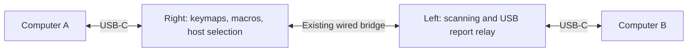

# PRD: UHK80 switching between two wired USB hosts

**Status:** Draft for review; feature not implemented or validated on hardware.

**Date:** 2026-10-09

**Product:** UHK80 firmware and compatible UHK Agent configuration support.

**Research baseline:** `leadZERO/UHK-Firmware`, commit
`0bc7edb864e675f6914583edba26d5d6d0a45abf`.

## 1. Problem and desired outcome

A UHK80 owner wants to use one complete keyboard with two computers, connecting
one computer to the right half's USB-C port and the other to the left half's
USB-C port. They want to switch destinations using the keyboard's existing host
selection features, without requiring Bluetooth or a dongle on either computer.

Today, the right USB port supports normal wired keyboard use. The left USB port
supports direct firmware updates, and its application already includes USB HID
interfaces, but it lacks the report forwarding and host-state integration needed
to serve as a selectable destination for the complete keyboard.

The desired result is two persistent USB connections and one selected input
destination. Keys from both halves, attached module input, layers, macros,
pointer movement, and media controls work on the selected computer.

## 2. Goals and success measures

| Goal | Evidence of success |
| --- | --- |
| Use two wired computer connections | Both computers enumerate the UHK80 through their respective USB-C connections; neither requires a wireless connection or host-side input-routing software. |
| Switch the complete keyboard | Existing named, indexed, previous/next, and active-host selection commands can select either USB host. |
| Keep input on the intended computer | Only the selected host receives user input; switches, reconnects, and queued reports do not send it to another host. |
| Preserve keyboard functionality | Both halves and supported attached modules provide keyboard, pointer, scrolling, consumer-control, and system-control actions on either host. |
| Make switching predictable | Held inputs, unavailable hosts, suspend, and reconnect follow the contracts below. |
| Support practical development | A contributor can build both halves in Windows/WSL, flash application images over USB, and inspect logs without purchasing a debug probe. |

Release success requires the hardware acceptance tests in section 9. Compilation
alone is insufficient. Performance thresholds in section 7 are proposed targets,
not measurements or promises about the current firmware.

## 3. Intended users and core scenarios

The primary user switches between a desktop and a laptop, or personal and work
computers, and prefers a wired connection for each. They configure the keyboard
through Agent and use a key or macro to select a computer during normal work.

Core scenarios:

1. Connect the right half to a desktop, the left half to a laptop, and the halves
   with the existing bridge cable. Configure names such as “Desktop” and
   “Laptop.” Type and use pointer/media actions on either selected computer.
2. Switch computers while both remain connected. Neither USB connection needs
   to be unplugged, re-enumerated, or paired again.
3. Select a computer that is sleeping or disconnected. Show its state and retain
   the user's explicit selection rather than sending input elsewhere.
4. Reconnect a selected computer or restore the inter-half link. Resume from a
   fresh input state without replaying typing or movement produced while offline.
5. Continue using existing right USB, Bluetooth, and dongle hosts alongside the
   new left USB option.

## 4. Scope and assumptions

### First release

- UHK80 left and right firmware, plus compatible Agent configuration/UI support.
- One computer per half's USB-C port, with both halves powered and running.
- The existing inter-half bridge cable as the required, fully wired setup.
- Complete input reporting and host feedback for both USB destinations.
- Existing host selection commands and automatic-switchover preferences.
- Normal USB firmware updates and diagnostics on both halves.

### Out of scope

- Independent left-half operation when the right half is absent or powered off.
- A second keymap/macro engine, separate configurations per computer, or
  simultaneous typing to both computers.
- Hardware modifications, a new bootloader, or a replacement USB stack.
- New Bluetooth/dongle behavior or a new radio-disable control.
- Live breakpoint debugging over the USB firmware-update connection.

The right half remains the keyboard's controller. The left half acts as a USB
input endpoint for the selected left host. Existing inter-half wireless fallback
may remain available under current policy, but the release must demonstrate the
fully wired path. New relay operation over Bluetooth is not a first-release
acceptance requirement; documentation must distinguish that from USB connections
to the computers.

## 5. User experience and configuration

Agent exposes two physical connection types: **USB Right** and **USB Left**.
Each can have a user-defined name and the existing automatic-switchover setting.
At most one configured slot represents each physical USB port.

Fresh UHK80 configurations include both USB slots. Existing configurations gain
an explicit way to add USB Left without replacing existing slots, changing their
indices, renaming them, or losing bindings. If all slots are occupied, Agent
explains that a slot must be freed; it must not silently overwrite one.

Selection remains separate from availability. Existing keyboard/Agent indicators
show the selected host's name and distinguish ready, sleeping, and unavailable
states where those surfaces support status display. Setup help explains the
bridge cable and the requirement for both halves to run. It must not imply that
the left half becomes an independent keyboard.

Examples using the existing macro syntax:

```text
switchHost "Desktop"
switchHost "Laptop"
switchHost nextActive
switchHost last
```

The computers use their normal USB HID drivers. Agent is needed for configuration
and diagnostics, but must not need to remain running for input or switching.

## 6. Functional requirements

**P0** requirements are necessary for release. **P1** requirements improve
diagnostics and supportability and may follow the core feature.

| ID | Priority | Requirement |
| --- | --- | --- |
| FR-01 | P0 | Both USB ports can remain attached to different computers and enumerate independently. Switching does not intentionally disconnect or re-enumerate either port. |
| FR-02 | P0 | Both halves' processed keyboard input, layers, macros, attached-module actions, pointer reports, scrolling, and consumer/system controls reach the selected host. |
| FR-03 | P0 | Add USB Left to the existing host-selection model, including names, slots, previous/next selection, active-host iteration, and configured switchover behavior. |
| FR-04 | P0 | Unselected hosts receive no new user input. Neutral reports needed to clear previously delivered state are allowed. |
| FR-05 | P0 | Switching to or from USB Left clears reachable old-host keys/buttons and establishes a fresh destination session. Delayed reports from the old selection cannot be delivered to the new host. |
| FR-06 | P0 | An explicitly selected unavailable host remains selected. Typing is discarded while it is unavailable; it is neither replayed on reconnect nor silently routed to another host. |
| FR-07 | P0 | Automatic fallback continues to respect existing per-host switchover preferences and explicit-selection semantics. `nextActive` selects only usable destinations. |
| FR-08 | P0 | Left USB availability includes both its local USB session and a working route from the right. Connect, disconnect, suspend, resume, and link changes propagate to the host-selection controller. |
| FR-09 | P0 | Each USB endpoint honors its own BOOT/report protocol and rollover settings. The right computer's negotiated protocol must not govern input sent to the left computer. |
| FR-10 | P0 | Caps/Num/Scroll Lock feedback and supported mouse scroll-resolution settings reflect the selected host. Feedback from an inactive host does not overwrite the active host's state. |
| FR-11 | P0 | Selecting or using a sleeping host honors USB remote-wakeup support and host permission. Failure to wake keeps the destination selected and displays its actual state. |
| FR-12 | P0 | Bridge loss, half reboot, queue saturation, and USB disconnect do not cause input to leak to another host, leave a reachable endpoint indefinitely holding keys/buttons, or stall scanning and host selection. |
| FR-13 | P0 | Restoring a route or USB session clears stale input state and resumes current operation. Relative pointer movement and typing generated while unavailable are not replayed. |
| FR-14 | P0 | Existing USB firmware flashing and vendor-command interfaces remain usable on both halves, including the inactive input endpoint. |
| FR-15 | P0 | Config serialization values remain compatible: USB Right is 1 and USB Left is 2. Migration preserves existing slots, bindings, names, and preferences. |
| FR-16 | P0 | Existing right USB, Bluetooth, dongle, and unrelated supported keyboard behavior do not regress. |
| FR-17 | P1 | Diagnostics expose selected host, USB/bridge state, queue usage, rejected stale reports, retries, and overflow counts through existing logs/shell facilities. |

### Input transition contract

The following is the proposed first-release policy for transitions involving
USB Left. Review compatibility with existing host-switch macros before
implementation. Changes to behavior between other existing host types require
separate review:

- On a switch, send neutral keyboard, pointer-button, and controls state to the
  old host when reachable; stop accepting user reports for its old selection.
- Treat held physical keys/buttons as suppressed until released and pressed
  again on the new host. The selection action itself must not appear as an
  unintended keypress on either host. A layer or other internal mode is not a
  host-held HID key; existing layer/keymap behavior remains in effect.
- Discard queued old-destination reports, including relative movement. Do not
  replay input accumulated while a destination or inter-half route was down.
- If a host is unreachable, a switch must not wait indefinitely for a release
  acknowledgement. Maintain a neutral/resynchronization requirement for that
  endpoint before subsequent input can resume. The firmware cannot force an
  unplugged or unresponsive computer to consume a release report immediately.
- Macro commands before an explicit `switchHost` belong to the old destination;
  commands after it intentionally target the new destination. Buffered prior
  output cannot cross the boundary. Synthetic held keys/buttons must be cleared
  and explicitly pressed again to be held on the new host.
- If the relay route is lost while the left USB endpoint remains connected, the
  left endpoint clears its held HID state after the bounded route-loss timeout.

| Event | Required result |
| --- | --- |
| Explicitly select a ready host | Clear old state, change selection, show the new name, and accept fresh input on the new host. |
| Explicitly select a disconnected host | Keep that selection, show unavailable, and discard input until ready. |
| Explicitly select a sleeping host | Select it and request permitted wakeup; do not send input to a different computer if wakeup fails. |
| Selected host disconnects | Mark unavailable; apply only existing authorized automatic fallback semantics. Retain explicit offline selection where current policy requires it. |
| Bridge disconnects | Restore the same selected destination through an alternate route only if existing link policy supports it; otherwise mark the left destination unavailable. |
| Inactive host connects or resumes | Refresh its cached state. Follow configured switchover policy without overriding an explicit offline selection. |
| Host or route reconnects | Establish fresh state before input; do not replay reports from the lost session. |

## 7. Performance and reliability requirements

These budgets are draft targets. Measure a baseline and the prototype before
confirming them for release; record any revised thresholds and their rationale.

| ID | Proposed target and measurement |
| --- | --- |
| NFR-01 | For two awake, ready hosts, 95th-percentile selection-to-ready time is at most 100 ms, measured from acceptance of the selection command to readiness for a fresh input report on the new host. Sleeping/offline hosts are measured separately. |
| NFR-02 | Left relay adds at most 10 ms at the 95th percentile for ordinary typing versus right USB, using the same scan settings and physical-key-to-host measurement method. Document the instrumented workload and absolute latencies. |
| NFR-03 | Keyboard transitions and button transitions are ordered and preserved while a route is healthy. Relative pointer deltas may be combined only if their totals are preserved; retries must not duplicate motion. |
| NFR-04 | All relay queues and retries are bounded. Overload produces observable counters and recovery, not indefinite blocking, silent routing to another host, or permanent held state. |
| NFR-05 | Both release images fit their application partitions and RAM budgets. Record linker sizes, queue limits, and runtime stack/heap evidence under stress. |
| NFR-06 | At least 1,000 alternating ready-host switches and a 60-minute mixed keyboard/pointer/macro soak produce no wrong-host input, stuck state, unexplained resets, or stale replay. |
| NFR-07 | When the left remains USB-connected but loses the route from the right, clear its held HID state within a proposed 1 second of route loss. Measure detection and neutral-report delivery separately; document limitations when its USB host cannot consume reports. |

No 1,000 Hz end-to-end relay guarantee is made. The current bridge is
115200-8N1, approximately 11,520 bytes/second in each direction before framing.
The inspected keyboard/mouse/controls payload structures are 29/11/10 bytes.
Capacity and sustained pointer latency must be measured; higher baud rates are
an engineering option only after validation on the existing hardware.

## 8. Engineering direction and constraints

This section records the recommended approach, not a complete technical design.



- Keep the right as master; relay processed reports rather than duplicating the
  keymap/macro engine. The existing right-to-dongle report path is a reference.
- Add an explicit relay destination and explicit local USB submission on the
  left. The current unhandled-sink fallback to right USB is not acceptable.
- Distinguish local USB state from synchronized remote-host state. Store
  per-host feedback and selection/session identity.
- Validate report sizes and sender identity. Define report ownership, completion,
  deduplication, stale-session rejection, and backpressure. A bridge ACK does not
  establish that a USB host consumed a report.
- Use a canonical keyboard report between halves and encode the left host's
  negotiated format at its USB endpoint where practical.
- Avoid blocking the left's scanning/state-sync loop with relay retries. Audit
  sleep and remote wakeup because the right currently cannot treat left USB as
  its awake host.
- Provide a firmware/Agent compatibility strategy and an upgrade sequence for
  both halves. A mismatched pair must fail predictably rather than misroute
  reports. Append new protocol identifiers without renumbering serialized ones.

Current release builds consume approximately **92.43% flash / 91.97% RAM** on
the right and **70.58% flash / 76.51% RAM** on the left. These are linker figures,
not runtime free-heap measurements. Small bounded buffers are important.

Useful source entry points:

| Area | Files |
| --- | --- |
| USB interfaces and initialization | `boards/ugl/uhk-80/shared.dtsi`, `device/src/main.c`, `right/src/hid/transport_usb.cpp` |
| Routing and encoding | `right/src/hid/transport.cpp`, `right/src/hid/keyboard_app.cpp` |
| Inter-half transport and receiver | `device/src/messenger.c`, `device/src/link_protocol.h`, `device/src/keyboard/uart_bridge.c` |
| Host identity, selection, and USB state | `right/src/host_connection.h`, `device/src/connections.c`, `right/src/usb_state.c` |
| Feedback and power | `device/src/state_sync.c`, `right/src/power_mode.c` |
| Agent schema and UI | `lib/agent/packages/uhk-common/src/config-serializer/config-items/host-connection.ts`, `lib/agent/packages/uhk-web/src/app/components/device/host-connections/` |

## 9. Acceptance and validation plan

The primary acceptance setup is a physical UHK80 with compatible firmware on both
halves, two independent USB computers, and the bridge cable attached. Start with
Windows 11 as one host because it matches the intended development workflow;
include a Linux host and a macOS compatibility pass. Record OS versions,
firmware/Agent versions, scan settings, and which inter-half route is active.

| Test | Pass condition |
| --- | --- |
| Two USB hosts and full input | Each computer stays enumerated. Keys from both halves, representative layers/macros, supported modules, pointer/scroll, and media/system reports work on the selected computer only. |
| Named and cyclic selection | Named/indexed selection, `last`, previous/next, and active-host iteration behave consistently with existing configuration preferences. |
| Held inputs and queued output | Switching with held modifiers, keys, pointer buttons, media keys, and an active macro satisfies the transition contract. No reachable host retains stuck state; no old output reaches the new host. |
| Host feedback and protocol | Different lock states and scroll settings remain independent. Test BOOT, 6KRO, and NKRO where supported; changing one endpoint's mode does not corrupt the other. |
| Offline, suspend, and resume | Explicit offline selection does not leak input or replay it later. Supported wakeup works; denied wakeup remains selected and accurately indicated. Configured automatic switchover still behaves as specified. |
| Link loss and half reboot | Disconnect/reconnect the bridge and reboot either half during held input. Verify unavailable state, endpoint clearing, fresh-session recovery, and no incorrect destination. Test any retained alternate-link fallback separately. |
| Busy link and queues | Sustained typing, macros, and pointer/scroll activity preserves transitions and motion totals while healthy. Forced loss/overflow is observable and recovers without stuck inputs or scanning stalls. |
| Config migration and Agent | A fresh configuration has both slots. Adding USB Left to existing configuration preserves indices and bindings; occupied-slot handling is explicit. Verify compatible Agent export/import and firmware upgrade flows. |
| Regression and updates | Right-only USB, existing BLE/dongle selection, both halves' USB updates, and diagnostics remain functional. Run existing checks appropriate to shared code changes. |
| Endurance, resources, and latency | Meet NFR-01 through NFR-07 on recorded workloads, or explicitly revise the draft budgets before release. |
| Physical setup and power | Verify simultaneous connections to two computers, including one asleep/offline, on the existing hardware. Both halves remain powered and function as documented. |

Use host-side report/event capture where practical to detect wrong-host reports,
missing releases, and duplicate relative motion. Add focused automated tests for
selection/session transitions, queue handling, and serialization where possible;
retain hardware tests for enumeration, timing, suspend/wakeup, and power.

## 10. Delivery stages and development enablement

| Stage | Deliverable and exit criterion |
| --- | --- |
| 0. Baseline and hardware proof | Build unmodified left/right images; establish USB flashing, logs, and recovery. Confirm left application HID interfaces and simultaneous two-computer connections. |
| 1. Keyboard-only prototype | Input from both halves reaches left USB through the wired bridge; switch back to right USB without stale or stuck keys. This is an experimental build, not the release scope. |
| 2. Host model and configuration | Integrate left readiness/selection, offline behavior, config migration, compatible Agent UI, and the transition contract. |
| 3. Complete input and lifecycle | Add pointer/controls, per-host protocol/feedback, suspend/wakeup, link-loss recovery, and bounded queues. |
| 4. Release candidate | Pass acceptance/regression tests, measure performance/resources, and publish user/developer setup and compatibility documentation. |

For the intended contributor, development uses WSL2 Ubuntu 24.04, Python 3.12,
Nordic nRF Connect SDK **v3.3.0**, and Zephyr SDK **0.17.4**. Build inside the
Linux filesystem; flash `zephyr.signed.bin` from native Windows using Agent's USB
updater. Preserve normal USB flashing and document recovery before experiments
that affect USB. Logs, the interactive shell, and ELF-based crash analysis must
remain useful without a probe; live SWD debugging is optional.

Verified baseline build commands from the firmware directory:

```bash
west build --sysbuild --build-dir device/build/uhk-80-right device -- --preset uhk-80-right
west build --sysbuild --build-dir device/build/uhk-80-left device -- --preset uhk-80-left
west build --sysbuild --build-dir device/build/uhk-80-right-debug device -- --preset uhk-80-right-debug
```

Build/install documentation must use the manifest's SDK version; the baseline
`build.sh` installer still references an older NCS version. The cloud baseline
has passed right/left release builds, dongle release, right debug, signature
verification, and offline GDB inspection. Windows installation, physical USB
flashing, and this feature's runtime behavior have not been validated here.

## 11. Risks and decisions before implementation/release

| Item | Required resolution |
| --- | --- |
| Left USB hardware/application behavior | Prove actual HID enumeration, input submission, and simultaneous two-computer operation in stage 0. |
| Held-key and macro policy | Review the proposed transition contract before implementation, including compatibility with existing host-switch macros. |
| Bridge capacity | Measure latency and sustained mouse traffic. Confirm achievable budgets and decide whether transport tuning is necessary. |
| Right-half memory pressure | Establish buffer budgets and demonstrate runtime headroom under stress. |
| Agent/config mismatch | Baseline firmware declares user config 15 / protocol 4.20; the pinned Agent declares config 14 / protocol 4.17. Select or update a compatible Agent before shipping configuration changes. |
| Inter-half version mismatch | Define protocol capability checks, mixed-version behavior, and a documented upgrade order. |
| Bootloader/recovery | Confirm the installed bootloader accepts the application images and verify the physical recovery procedure without a probe. Do not require a bootloader replacement for this feature. |
| Suspend, wakeup, and power | Verify behavior with independent host suspend states and both USB cables attached. |

The PRD defines the proposed product behavior and release gates. Hardware
feasibility, performance targets, and the compatibility plan remain to be proven;
the existing left USB hardware and dongle report-relay architecture provide a
credible starting point.
