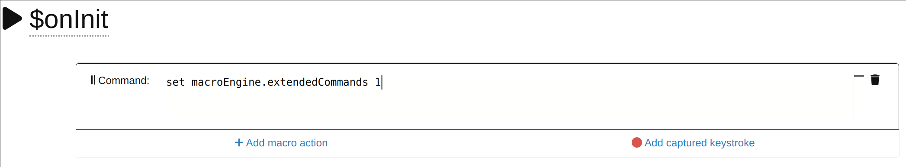
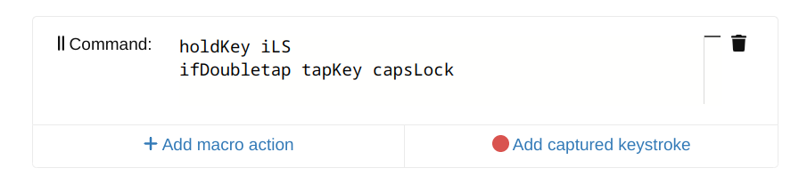

# Extended macro engine

Extended macro engine is developed on kareltucek/firmware and occasionally merged into the stock firmware. The extended macro engine can be enabled by `set macroEngine.extendedCommands 1` or built using either `make-release.js --extendedMacros` or `make CUSTOM_CFLAGS=-DEXTENDED_MACROS`. Otherwise, stock builds are limited to just a few commands - approximately to `set` and `printStatus`. The extended features are not thoroughly tested, and are more likely to be removed or reshaped in the future.

The extended engine implements:
- macro commands for most features of the keyboard
- conditionals, jumps and sync mechanisms
- runtime macro recorder implemented on scancode level, for vim-like macro functionality
- many configuration options
- ability to run multiple macros at the same time

Some of the usecases which can be achieved via these commands are:
- mimicking secondary roles
- binding actions to doubletaps
- binding arbitrary shortcuts or gestures
- binding shift and non-shift scancodes independently
- configuring custom layer switching logic, including nested layer toggling
- unlimited number of layers via referencing layers of different keymaps

## Getting started

0.1) Get your UHK :-). https://ultimatehackingkeyboard.com/

0.2) Unless you specifically wish to use the extended command set, you may wish to start with officially supported macros. In that case, please see the smart macro reference included in the right-side pane of Agent. Its quality is far superior to this document, and features various interactive 

1) If you are using stock firmware and want to use full power of the engine, you need to create a macro named `$onInit` with following content. Skip this step if you are using firmware from kareltucek/firmware repository. (This is a macro event, which will be automatically executed whenever the keyboard is powercycled.):

```
set macroEngine.extendedCommands 1
```



2) Create some macro with some command action. (And bind it in your keymap.) For instance:

```
holdKey leftShift
ifDoubletap tapKey capsLock
```



3) Understand how this guide and the reference manual work:

    - Use Ctrl+F (or equivalent) a lot - here, and in the [reference manual](reference-manual.md).
    - Go through the sections of the reference manual - just reading the top section lines will give you some idea about available types of commands.
    - Read through examples in order to understand how the constructs can be combined.
    - Understand how to read the stated ebnf grammar. The grammar gives you precise instructions about available features and their parameters, as well as correct syntax. Note that some commands and parameters are only mentioned in the grammar! In case you don't know anything about grammars:
        - The grammar describes a valid expression via a set of rules. At the beginning, the expression equals "BODY". Every capital word of the expression is to be "rewritten" by a corresponding rule - i.e., the identifier is to be replaced by an expression which matches right side of the rule.
        - Notation: `<>` mark informal (human-understandable) explanation of what is to be entered. `|` operator indicates choice between left and right operand. It is typically enclosed in `{}`, in order to separate the group from the rest of the rule. `[]` denote optional arguments. Especially `[]+` marks "one or more" and `[]*` arbitrary number.
        - Provided value bounds are informational only - they denote values that seem to make sense. Sometimes default values are marked.
    - If you are still not sure about some feature or syntax, do not hesitate to ask.

4) If `ERR` appears up on the display, you can retrieve description by using `printStatus` over a focused text editor. Or, using above point, just search the [reference manual](reference-manual.md) for `ERR`.

5) If you encounter a bug, let me know. There are lots of features and quite few users around this codebase - if you do not report problems you find, chances are that no one else will (since most likely no one else has noticed).

## Examples

Every nonempty line is considered as one command. Empty line, or commented line too. Empty lines are skipped. Exception is empty command action, which counts for one command.

### Configuration

Configuration of the keyboard can be modified globally or per-keymap by using [macro events](reference-manual.md). For instance, macro named `$onInit` may contain following speed configuration:

```
# enable extended commands in case you are using stock firmware.
set macroEngine.extendedCommands 1

# accel driver
set module.trackball.baseSpeed 0.5
set module.trackball.speed 1.0
set module.trackball.xceleration 0.5

//navigation modes
set module.trackball.navigationMode.base cursor
set module.trackball.navigationMode.fn caret
set module.trackball.navigationMode.mod scroll
set module.trackball.navigationMode.mouse scroll

//axis locks
set module.trackball.scrollAxisLock 1
set module.trackball.cursorAxisLock 0

//backlight defaults
set backlight.strategy constantRgb
set backlight.constantRgb.rgb 255 192 32
set leds.fadeTimeout 1
```

To change sensitivity of modules, use the following snippet in your `$onInit` macro (to always apply), in your `$onKeymapChange QWR` macro (to change sensitivity in the QWR keymap), or in a regular macro (to change sensitivity on demand).

In order to figure out right values, please see the Agent macro reference, or search the reference manual.

```
set module.trackball.baseSpeed 0.5
set module.trackball.speed 1.0
set module.trackball.xceleration 0.5
```

This enables and disables compensation of diagonal speed depending on shift state.

```
ifShift set diagonalSpeedCompensation 1
ifNotShift set diagonalSpeedCompensation 0
```

### Binding keys and basic principles


Key lifecycle consists of two important points:

- key press
- key release

Various combinations of lifecycles are abstracted into four key actions:

- `pressKey` - just activate the scancode
- `releaseKey` - just deactivate it
- `tapKey` - activate the scancode and then immediately release it
- `holdKey` - activate the scancode and hold it for as long as the key is physically held, then release it

So if we wanted to replace a regular 'a' key with a macro, we would use:

```
holdKey a
```

Which is similar to:

```
pressKey a
delayUntilRelease
releaseKey a
```

If we just want to quickly produce the `a` scancode/character, we would use:

```
tapKey a
```

Which is similar to:
```
pressKey a
releaseKey a
```

Complex key sequences can be achieved using `tapKeySeq`. For instance, following emoji macro (uses linux  Ctrl+U notation) - tap `thisMacro + s + h` (as shrug) to get shrugging person, or `thisMacro + s + w` to get sweaty smile. 
```
ifGesture 80 73 final tapKeySeq CS-u 1 f 6 0 5 space
```

With these commands, modifiers are encoded using `CSAG`, with optional `LR` for left and right side. E.g., `LC-a` means `left control + a`.

Press/release/hold/tap can be specified by `phtr` part of the mask. E.g., `tapKeySeq p-a t-b t-c r-a` means tap `b c` while holding `a`.

In macros, we also may chain multiple actions, and include various conditions.

For instance, shift which also toggles caps lock on doubletap:

```
holdKey leftShift
ifDoubletap tapKey capsLock
```

Or with Mac (which requires prolonged press of caps lock):

```
holdKey leftShift
ifNotDoubletap break
pressKey capsLock
delayUntil 400
releaseKey capsLock
```

Mapping shift/nonshift scancodes independently:

```
ifShift suppressMods write 4
ifNotShift write %
```

Some common conditions are:
- `ifDoubletap` - yields true if another instance of the same macro executed lately.
- `ifInterrupted` - yields true if another key was pressed during execution of the macro.
- `ifPlaytime 100` - yields true if macro ran for at least 100 ms.
- `ifShift` - yields true if regular shift key is being held. (See composition modes in the reference for more info on how to hack more complex setups)

Conditions always exist in pairs, e.g., `ifDoubletap` and `ifNotDoubletap`, `ifPlaytime` and `ifNotPlaytime` etc.

There is also a concept of modifiers, which can modify keyboard's or command's behaviour while a command is running:

- `suppressMods` - suppresses all standard modifiers, so you can rebind a shift and nonShift independent (or on the contrary dependent!) on shift state.
- `final` - ends macro after the "modified" command. Basically a syntactic sugar.
- `postponeKeys` - in order to mess with our time machine.
- `autoRepeat` - if we need to autorepeat manually from keyboard. For instance `autoRepeat progressHue`.

### Handling layers

**WARNING:** macro engine has separate layer system from the native layer action. Layers toggled from macros need to also be untoggled from macros. There may be some other problems regarding integration of these two system - if you notice any, please do report them.

Main benefit of the macro layer system is that it keeps full-fledged layer stack, therefore allowing nested layer holds, and various interactive features.

Following macro will result in switching to QWR keymap.

```
switchKeymap QWR
```

Implementation of standard double-tap-locking hold modifier in recursive version could look like: ("Recursivity" refers to ability to toggle another layer on top of the toggled layer.)

```
holdLayer fn
ifDoubletap toggleLayer fn
```

Once the layer is toggled, the target layer needs to contain another macro to allow return to the base layer. This macro also allows holding previous (usually base) layer from a toggled layer.

```
holdLayer previous
ifDoubletap unToggleLayer
```

Smart toggle (if tapped, locks layer; if used with a key, acts as a simple secondary role):

```
holdLayer mouse
ifNotInterrupted toggleLayer mouse
```

You can refer to layers of different keymaps via a set of `keymapLayer` commands. Be careful though, these reload entire keymaps, so they may pose a performance penaly, and they also reset all your in-memory configurations:

```
holdKeymapLayer QWR base
```

### Time machine

The firmware implements a postponing queue which allows some commands to act as a time machine by querying _future_ keystrokes, and decide what to do depending on those. In practice, it means waiting until more input is entered, and then either consuming those keys and doing something special, or rewinding back a bit and performing all the actions as if nothing happened.

One concept which uses this feature is _shortcuts and gestures_.

You can use `ifShortcut` when you want to map an action to a combination of keys. E.g, if I want z+x to produce Control+x, z+c to produce Control+c, z+v to produce Control+v, I will map following macro on the z key:

```
ifShortcut 88 final tapKey C-x
ifShortcut 89 final tapKey C-c
ifShortcut 90 final tapKey C-v
holdKey z
```

An `ifShortcut` macro needs to be placed on the first key of the shortcut, and refers to other keys by Their hardware ids. These ids can be obtained by `resolveNextKeyId` command (i.e., activating the command and pressing the key while having a text editor focused). The `final` modifier breaks the command after the "modified" `tapKey` command finishes.

`ifGesture` can be used to implement "loose gestures" - i.e., shortcuts where the second keypress can follow without continuity of press of the first key. Vim-like gt and gT (g+shift+t) tab switching:

```
ifGesture 077 final tapKey C-pageUp
ifGesture 085 077 final tapKey C-pageDown
holdKey g
```

We can also use these to implement an emoji macro which allows us to write emojis using simple abbreviations - here tap `thisMacro + s + h` (as shrug) to get shrugging person, or `thisMacro + s + w` to get sweaty smile.

```
ifGesture 80 73 final tapKeySeq CS-u 1 f 6 0 5 space
ifGesture 80 21 final tapKeySeq CS-u 1 f 9 3 7 space
...
```

In order to bind some action to doubletap, you may use two strategies:

- simple `ifDoubletap` condition, which just checks whether another instance of the same macro was activae lately. Doubletapping this will result in sequence `ab`:

```
    ifDoubletap final tapKey b
    holdKey a
```

- time-machine `ifGesture` condition. Doubletapping this will produce a slight delay and then output just `b`:

```
    ifGesture #key final tapKey b
    holdKey a
```

Another concept which may or may not use our time machine is secondary roles.

Secondary role is a role which becomes active if another key is pressed with this key. It can be implemented in two variants: regular and postponed.

- Regular version can be implemented using `ifNotInterrupted`  - such macro always triggers secondary role, and once the key is released it either triggers primary role or not.

- Postponed version postpones all other keypresses until it can distinguish between primary and secondary role. This is handy for alphabetic keys, or if the secondary role is not a no-op. The postponed version can be used either via `ifPrimary` and `ifSecondary` conditions, or via a `resolveSecondary`.

Regular implementation of secondary role:

```
holdLayer mouse
ifNotInterrupted tapKey enter
```

Regular secondary role with prevention of accidential key taps: (Activates the secondary role immediately, but activates the primary role only if the key has been pressed for at least a certain amount of time. This could be used to emulate the [Space Cadet Shift feature](https://beta.docs.qmk.fm/using-qmk/advanced-keycodes/feature_space_cadet).)

```
holdKey leftShift
ifInterrupted break
ifPlaytime 200 break
tapKey S-9
```

Postponed secondary role switch using `ifPrimary`:

```
ifPrimary final holdKey a
holdLayer mouse
```

Postponed secondary role switch - `resolveSeccondary` is a bit more flexible and less user-friendly version of the `ifPrimary`/`ifSecondary` command. The `resolveSecondary` will listen for some time and once it decides whether the current situation fits primary or secondary action, it will issue goTo to the "second" line (line 1 since we index from 0) or the last line (line 3). Actions are indexed from 0.

```
resolveSecondary 350 1 3
write f
break
holdLayer mod
```

### Advanced key binding

In order to bind action to a complex shortcut, you can bind an `ifShortcut` macro onto the first key of such shortcut, as already shown above.

In order to bind action to sequence of keys, you can use `ifGesture`.

You can also use the `set keymapAction` to dynamically rebind keys in current keymap. Such bindings will last until keymap reload.

```
set keymapAction.base.15 keystroke left
set keymapAction.base.16 keystroke down
set keymapAction.base.17 keystroke right
set keymapAction.base.8 keystroke up
```

You may also use similar syntax to bind stuff into module navigation modes. E.g., you may repurpose your mini-trackball to do some vim magic (with `VimMTL` and `VimMTR` macros):

```
set navigationModeAction.media.left macro VimMTL
set navigationModeAction.media.right macro VimMTR
set navigationModeAction.media.up none
set navigationModeAction.media.down none
set module.keycluster.navigationMode.base media
```

Similarly, you may rebind your touchpad's "right button" by using following `$onKeymapChange any` macro event:

```
#this needs to go into a macro named `$onKeymapChange any`
set keymapAction.base.192 macro TouchpadLeft
set keymapAction.base.193 macro TouchpadRight
```

### Advanced commands:

You can simplify writing macros by using `#` and `@` characters. The first resolves a number as an index of a register. The second interprets the number as a relative action index. For instance the following macro will write out five "a"s with 50 ms delays

```
#you can comment your code via a hash
//you can comment your code via two slashes.
// yes, this is a totally meaningless example
ifCtrl goTo default    //goto can also go to labels, absolute adresses and relative adresses
ifShift final tapKey a //final modifier ends the macro once the command has finished
setReg 0 50            //store number 50 into register 0
setReg 1 5
tapKey a
delayUntil #0          //the #0 is expanded to content of register 0
repeatFor 1 @-2        //decrement register 1; if it is non-zero, return by two commands to the tapKey command
noOp                   //note the @ character - it resolves relative address to absolute (i.e., adds current adr)
default: tapKey b      //<string>: denotes a label, which can be used as jump target
```

You can use `goTo @0` as an active wait loop. Consider following example. If briefly tapped, it produces `@@` (play last vim macro). If held, it prepends any other key tap with a `@` key. E.g., `thisMacro + p + p + p` produces `@p@p@p` (play vim macro in register p, twice).

```
begin: postponeKeys ifNotPending 1 ifNotReleased goTo @0
postponeKeys ifReleased final ifNotInterrupted ifNotPlaytime 300 tapKeySeq @ @
postponeKeys ifPending 1 tapKey @
postponeKeys setReg 0 %0
ifPending 1 goTo @0
ifKeyActive #0 goTo @0
goTo begin
```

Simple active wait loop example, to simulate qmk "caps words" - a feature which acts as a caps lock, but automatically turns off on space character:

On activation key:

```
pressKey LS-
setReg 5 1
ifRegEq 5 1 goTo @0
#at the end of macro, the shift gets released automatically
```

on space:

```
holdKey space
setReg 5 0
```

### Macro recorder

In this setup, shift+key will start recording (indicated by the "adaptive mode" led), another shift+key will stop recording. Hiting the key alone will then replay the macro (e.g., a simple repetitive text edit). Alternatively, virtual register `#key` can be used as an argument in order to assign every key to different slot.

```
ifShift recordMacro A
ifNotShift playMacro A
```

Above examples can be combined into more elaborate setups. Assume we bind following `perKeyMacro` on every key in your fn layer. Furthermore assume we bind following `recordKey` macro onto the `q` key (or `mod-q`). This gives us standard (although incomplete) vim behaviour. Tap `qa` (`mod-q + a`) to start recording a macro in slot "a". Tap `q` (`mod-q`) to end recording. Tap `fn-a` to replay the macro.

```
# perKeyMacro
ifShift final recordMacro #key
ifRegEq 27 1 final recordMacro #key
playMacro #key
```

```
# recordKey
ifRecording final stopRecording
ifRegEq 27 1 final setReg 27 0
setReg 27 1
toggleLayer fn
ifNotRecording ifNotPlaytime 5000 ifRegEq 27 1 goTo @0
unToggleLayer
setReg 27 0
```

### Per-key LEDs fun:

Colour picker for constant colours. Bound on fn+r, fn+r+r turns colour to red, fn+r+v to violet, etc..

```
ifGesture 75 final set backlight.constantRgb.rgb 255 32 0  // r - red
ifGesture 84 final set backlight.constantRgb.rgb 192 255 0  // g - green
ifGesture 91 final set backlight.constantRgb.rgb 128 192 255 // b - blue
ifGesture 14 final set backlight.constantRgb.rgb 255 192 0 // y - yellow
ifGesture 90 final set backlight.constantRgb.rgb 192 64 255 // v - violet
ifGesture 9 final set backlight.constantRgb.rgb 255 128 0 // o - orange
ifGesture 73 final set backlight.constantRgb.rgb 192 32 0 // w - wine
ifGesture 21 final set backlight.constantRgb.rgb 128 48 0 // b - brown
ifGesture 22 final set backlight.constantRgb.rgb 255 192 32 // n - warm white, as "normal"
ifGesture 82 final set backlight.strategy functional // f to functional backlight
ifGesture 72 final set leds.enabled 0 // q - to turn off
ifGesture 10 final set leds.enabled 1 // p - to turn back on
```

To see all possible UHK hues (maximum saturation), hold a key with the following macro:

```
autoRepeat progressHue
```

In order to make UHK slowly rotate through all rainbow colors all the time, you can use the following macro:

```
progressHue
delayUntil 1000
goTo 0
```

Above macro will not terminate, not even when ran multiple times. In order to fix this issue, we can use some register signalling:

```
# prevent the macro from running multiple times via (randomly picked) register 22
setReg 22 1
delayUntil 2000
setReg 22 0
beginLoop:
ifRegEq 22 1 break
progressHue
delayUntil 1000
goTo beginLoop
```

You can also start this from `$onInit` by `fork rotateHues` (given you have the macro named `rotateHues`). Or add following lines to the colour picker:

```
# put this at the beginning of the picker, to stop rotateHues when another choice is made.
setReg 22 1
# start the `rotateHues` macro on 'c' - as "changing"
ifGesture 89 final fork rotateHues
```

# Further reading

- [reference manual](reference-manual.md)

